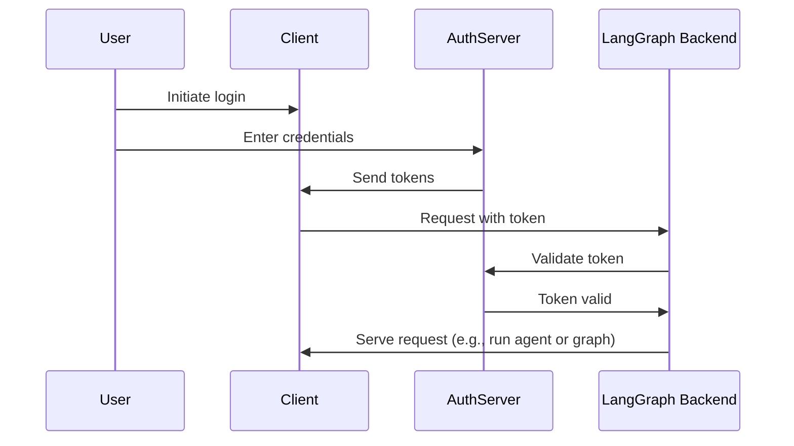

[이전 튜토리얼](/langsmith/resource-auth)에서는 사용자에게 비공개 대화를 제공하기 위해 리소스 권한 부여를 추가했습니다. 하지만 여전히 인증을 위해 하드코딩된 토큰을 사용하고 있어 안전하지 않습니다. 이제 [OAuth2](/langsmith/deployment-quickstart)를 사용하여 이러한 토큰을 실제 사용자 계정으로 대체하겠습니다.

동일한 [`Auth`](/langsmith/langgraph-python-sdk#langgraph_sdk.auth.Auth) 객체와 [리소스 수준 접근 제어](/langsmith/auth#single-owner-resources)를 유지하되, Supabase를 신원 제공자로 사용하도록 인증을 업그레이드합니다. 이 튜토리얼에서는 Supabase를 사용하지만, 개념은 모든 OAuth2 제공자에 적용됩니다. 다음 내용을 배우게 됩니다:

1. 테스트 토큰을 실제 JWT 토큰으로 교체하기
2. 안전한 사용자 인증을 위해 OAuth2 제공자와 통합하기
3. 기존 권한 부여 로직을 유지하면서 사용자 세션 및 메타데이터 처리하기

## 배경 지식

OAuth2는 세 가지 주요 역할을 포함합니다:

1. **인증 서버**: 사용자 인증을 처리하고 토큰을 발급하는 신원 제공자(예: Supabase, Auth0, Google)
2. **애플리케이션 백엔드**: 토큰을 검증하고 보호된 리소스(대화 데이터)를 제공하는 LangGraph 애플리케이션
3. **클라이언트 애플리케이션**: 사용자가 서비스와 상호작용하는 웹 또는 모바일 앱

표준 OAuth2 플로우는 다음과 같이 작동합니다:



## 사전 요구사항

이 튜토리얼을 시작하기 전에 다음을 확인하세요:

* [두 번째 튜토리얼의 봇](/langsmith/resource-auth)이 오류 없이 실행되고 있어야 합니다.
* 인증 서버로 사용할 [Supabase 프로젝트](https://supabase.com/dashboard)가 필요합니다.

## 1. 의존성 설치

필요한 의존성을 설치합니다. `custom-auth` 디렉토리에서 시작하여 `langgraph-cli`가 설치되어 있는지 확인하세요:

<CodeGroup>
```bash pip
cd custom-auth
pip install -U "langgraph-cli[inmem]"
```

```bash uv
cd custom-auth
uv add langgraph-cli[inmem]
```
</CodeGroup>

<a id="setup-auth-provider"></a>
## 2. 인증 제공자 설정

다음으로 인증 서버의 URL과 인증용 비공개 키를 가져옵니다.
Supabase를 사용하므로 Supabase 대시보드에서 다음을 수행할 수 있습니다:

1. 왼쪽 사이드바에서 "⚙ Project Settings"를 클릭한 다음 "API"를 클릭합니다
2. 프로젝트 URL을 복사하여 `.env` 파일에 추가합니다
  ```shell
  echo "SUPABASE_URL=your-project-url" >> .env
  ```
3. 서비스 역할 비밀 키를 복사하여 `.env` 파일에 추가합니다:
  ```shell
  echo "SUPABASE_SERVICE_KEY=your-service-role-key" >> .env
  ```
4. "anon public" 키를 복사하여 메모해 둡니다. 나중에 클라이언트 코드를 설정할 때 사용됩니다.
  ```bash
  SUPABASE_URL=your-project-url
  SUPABASE_SERVICE_KEY=your-service-role-key
  ```

## 3. 토큰 검증 구현

이전 튜토리얼에서는 [`Auth`](/langsmith/langgraph-python-sdk#langgraph_sdk.auth.Auth) 객체를 사용하여 [하드코딩된 토큰을 검증](/langsmith/set-up-custom-auth)하고 [리소스 소유권을 추가](/langsmith/resource-auth)했습니다.

이제 Supabase에서 실제 JWT 토큰을 검증하도록 인증을 업그레이드합니다. 주요 변경 사항은 모두 [`@auth.authenticate`](/langsmith/langgraph-python-sdk#langgraph_sdk.auth.Auth.authenticate) 데코레이터 함수에 있습니다:

* 하드코딩된 토큰 목록과 비교하는 대신 Supabase에 HTTP 요청을 보내 토큰을 검증합니다.
* 검증된 토큰에서 실제 사용자 정보(ID, 이메일)를 추출합니다.
* 기존 리소스 권한 부여 로직은 변경되지 않습니다.

이를 구현하기 위해 `src/security/auth.py`를 업데이트합니다:

```python {highlight={8-9,20-30}} title="src/security/auth.py"
import os
import httpx
from langgraph_sdk import Auth

auth = Auth()

# 위에서 생성한 `.env` 파일에서 로드됩니다
SUPABASE_URL = os.environ["SUPABASE_URL"]
SUPABASE_SERVICE_KEY = os.environ["SUPABASE_SERVICE_KEY"]


@auth.authenticate
async def get_current_user(authorization: str | None):
    """JWT 토큰을 검증하고 사용자 정보를 추출합니다."""
    assert authorization
    scheme, token = authorization.split()
    assert scheme.lower() == "bearer"

    try:
        # 인증 제공자로 토큰 검증
        async with httpx.AsyncClient() as client:
            response = await client.get(
                f"{SUPABASE_URL}/auth/v1/user",
                headers={
                    "Authorization": authorization,
                    "apiKey": SUPABASE_SERVICE_KEY,
                },
            )
            assert response.status_code == 200
            user = response.json()
            return {
                "identity": user["id"],  # 고유 사용자 식별자
                "email": user["email"],
                "is_authenticated": True,
            }
    except Exception as e:
        raise Auth.exceptions.HTTPException(status_code=401, detail=str(e))

# ... 나머지는 이전과 동일합니다

# 이전 튜토리얼의 리소스 권한 부여를 유지합니다
@auth.on
async def add_owner(ctx, value):
    """리소스 메타데이터를 사용하여 생성자만 리소스에 접근할 수 있도록 합니다."""
    filters = {"owner": ctx.user.identity}
    metadata = value.setdefault("metadata", {})
    metadata.update(filters)
    return filters
```

가장 중요한 변경 사항은 이제 실제 인증 서버로 토큰을 검증한다는 것입니다. 인증 핸들러는 Supabase 프로젝트의 비공개 키를 가지고 있으며, 이를 사용하여 사용자의 토큰을 검증하고 정보를 추출할 수 있습니다.

## 4. 인증 플로우 테스트

새로운 인증 플로우를 테스트해 보겠습니다. 파일이나 노트북에서 다음 코드를 실행할 수 있습니다. 다음을 제공해야 합니다:

* 유효한 이메일 주소
* Supabase 프로젝트 URL ([위](#setup-auth-provider)에서)
* Supabase anon **공개 키** ([위](#setup-auth-provider)에서)

```python
import os
import httpx
from getpass import getpass
from langgraph_sdk import get_client


# 커맨드 라인에서 이메일 가져오기
email = getpass("Enter your email: ")
base_email = email.split("@")
password = "secure-password"  # CHANGEME
email1 = f"{base_email[0]}+1@{base_email[1]}"
email2 = f"{base_email[0]}+2@{base_email[1]}"

SUPABASE_URL = os.environ.get("SUPABASE_URL")
if not SUPABASE_URL:
    SUPABASE_URL = getpass("Enter your Supabase project URL: ")

# 이것은 PUBLIC anon 키입니다 (클라이언트 측에서 사용해도 안전함)
# 비밀 서비스 역할 키와 혼동하지 마세요
SUPABASE_ANON_KEY = os.environ.get("SUPABASE_ANON_KEY")
if not SUPABASE_ANON_KEY:
    SUPABASE_ANON_KEY = getpass("Enter your public Supabase anon  key: ")


async def sign_up(email: str, password: str):
    """새 사용자 계정을 생성합니다."""
    async with httpx.AsyncClient() as client:
        response = await client.post(
            f"{SUPABASE_URL}/auth/v1/signup",
            json={"email": email, "password": password},
            headers={"apiKey": SUPABASE_ANON_KEY},
        )
        assert response.status_code == 200
        return response.json()

# 두 명의 테스트 사용자 생성
print(f"Creating test users: {email1} and {email2}")
await sign_up(email1, password)
await sign_up(email2, password)
```

⚠️ 계속하기 전에: 이메일을 확인하고 두 확인 링크를 모두 클릭하세요. 사용자의 이메일을 확인하기 전까지 Supabase는 `/login` 요청을 거부합니다.

이제 사용자가 자신의 데이터만 볼 수 있는지 테스트합니다. 계속하기 전에 서버가 실행 중인지 확인하세요(`langgraph dev` 실행). 다음 스니펫은 이전에 [인증 제공자 설정](#setup-auth-provider) 시 Supabase 대시보드에서 복사한 "anon public" 키가 필요합니다.

```python
async def login(email: str, password: str):
    """기존 사용자의 액세스 토큰을 가져옵니다."""
    async with httpx.AsyncClient() as client:
        response = await client.post(
            f"{SUPABASE_URL}/auth/v1/token?grant_type=password",
            json={
                "email": email,
                "password": password
            },
            headers={
                "apikey": SUPABASE_ANON_KEY,
                "Content-Type": "application/json"
            },
        )
        assert response.status_code == 200
        return response.json()["access_token"]


# 사용자 1로 로그인
user1_token = await login(email1, password)
user1_client = get_client(
    url="http://localhost:2024", headers={"Authorization": f"Bearer {user1_token}"}
)

# 사용자 1로 스레드 생성
thread = await user1_client.threads.create()
print(f"✅ User 1 created thread: {thread['thread_id']}")

# 토큰 없이 접근 시도
unauthenticated_client = get_client(url="http://localhost:2024")
try:
    await unauthenticated_client.threads.create()
    print("❌ Unauthenticated access should fail!")
except Exception as e:
    print("✅ Unauthenticated access blocked:", e)

# 사용자 2로 사용자 1의 스레드에 접근 시도
user2_token = await login(email2, password)
user2_client = get_client(
    url="http://localhost:2024", headers={"Authorization": f"Bearer {user2_token}"}
)

try:
    await user2_client.threads.get(thread["thread_id"])
    print("❌ User 2 shouldn't see User 1's thread!")
except Exception as e:
    print("✅ User 2 blocked from User 1's thread:", e)
```

출력은 다음과 같아야 합니다:

```shell
✅ User 1 created thread: d6af3754-95df-4176-aa10-dbd8dca40f1a
✅ Unauthenticated access blocked: Client error '403 Forbidden' for url 'http://localhost:2024/threads'
✅ User 2 blocked from User 1's thread: Client error '404 Not Found' for url 'http://localhost:2024/threads/d6af3754-95df-4176-aa10-dbd8dca40f1a'
```

인증과 권한 부여가 함께 작동하고 있습니다:

1. 사용자는 봇에 접근하기 위해 로그인해야 합니다
2. 각 사용자는 자신의 스레드만 볼 수 있습니다

모든 사용자는 Supabase 인증 제공자에서 관리되므로 추가적인 사용자 관리 로직을 구현할 필요가 없습니다.

## 다음 단계

LangGraph 애플리케이션을 위한 프로덕션 수준의 인증 시스템을 성공적으로 구축했습니다! 지금까지 달성한 내용을 살펴보겠습니다:

1. 인증 제공자 설정(이 경우 Supabase)
2. 이메일/비밀번호 인증을 사용하는 실제 사용자 계정 추가
3. LangGraph 서버에 JWT 토큰 검증 통합
4. 사용자가 자신의 데이터만 접근할 수 있도록 적절한 권한 부여 구현
5. 다음 인증 과제를 처리할 준비가 된 기반 구축 🚀

이제 프로덕션 인증을 갖추었으므로 다음을 고려해 보세요:

1. 선호하는 프레임워크로 웹 UI 구축하기(예시는 [Custom Auth](https://github.com/langchain-ai/custom-auth) 템플릿 참조)
2. [인증에 대한 개념 가이드](/langsmith/auth)에서 인증 및 권한 부여의 다른 측면에 대해 자세히 알아보기
3. [참조 문서](/langsmith/langgraph-python-sdk#langgraph_sdk.auth.Auth)를 읽고 핸들러와 설정을 추가로 커스터마이징하기

---

<Callout icon="pen-to-square" iconType="regular">
    [Edit the source of this page on GitHub.](https://github.com/langchain-ai/docs/edit/main/src/langsmith/add-auth-server.mdx)
</Callout>
<Tip icon="terminal" iconType="regular">
    [Connect these docs programmatically](/use-these-docs) to Claude, VSCode, and more via MCP for    real-time answers.
</Tip>
