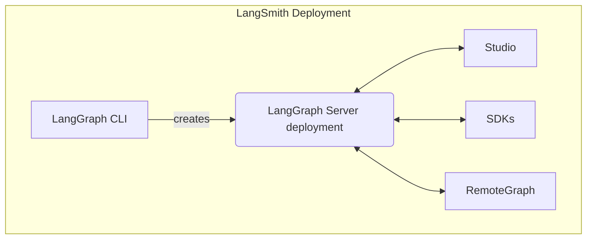

[배포와 함께 셀프 호스팅 LangSmith](/langsmith/deploy-self-hosted-full-platform)를 실행할 때 설치에는 여러 핵심 구성 요소가 포함됩니다. 이러한 도구와 서비스는 함께 자체 인프라에서 그래프(에이전트 애플리케이션 포함)를 빌드, 배포 및 관리하기 위한 완전한 솔루션을 제공합니다:

- [LangGraph Server](/langsmith/langgraph-server): 그래프와 에이전트를 배포하기 위한 독단적인 API와 런타임을 정의합니다. 실행, 상태 관리 및 지속성을 처리하므로 서버 인프라가 아닌 로직 구축에 집중할 수 있습니다.
- [LangGraph CLI](/langsmith/cli): 로컬에서 그래프를 빌드, 패키징 및 상호작용하고 배포를 준비하는 명령줄 인터페이스입니다.
- [Studio](/langsmith/studio): 시각화, 상호작용 및 디버깅을 위한 전문 IDE입니다. 그래프를 개발하고 테스트하기 위해 로컬 LangGraph Server에 연결합니다.
- [Python/JS SDK](/langsmith/sdk): Python/JS SDK는 애플리케이션에서 배포된 그래프 및 에이전트와 상호작용하는 프로그래매틱 방법을 제공합니다.
- [RemoteGraph](/langsmith/use-remote-graph): 배포된 그래프와 로컬에서 실행되는 것처럼 상호작용할 수 있습니다.
- [Control Plane](/langsmith/control-plane): LangGraph Server 배포를 생성, 업데이트 및 관리하기 위한 UI 및 API입니다.
- [Data plane](/langsmith/data-plane): LangGraph Server, 백업 서비스(PostgreSQL, Redis 등) 및 control plane에서 상태를 조정하는 리스너를 포함하여 그래프를 실행하는 런타임 레이어입니다.

---

<Callout icon="pen-to-square" iconType="regular">
    [Edit the source of this page on GitHub.](https://github.com/langchain-ai/docs/edit/main/src/langsmith/components.mdx)
</Callout>
<Tip icon="terminal" iconType="regular">
    [Connect these docs programmatically](/use-these-docs) to Claude, VSCode, and more via MCP for    real-time answers.
</Tip>
