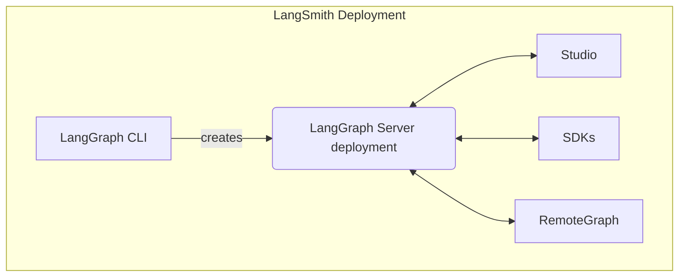

<Info>
**사전 요구 사항**
* [LangSmith](/langsmith/home)
* [LangGraph Server](/langsmith/langgraph-server)
* [LangGraph CLI](/langsmith/cli)
</Info>

Studio는 LangGraph Server API 프로토콜을 구현하는 에이전트 시스템의 시각화, 상호작용 및 디버깅을 지원하는 전문화된 에이전트 IDE입니다. Studio는 [추적](/langsmith/observability-concepts), [평가](/langsmith/evaluation), [프롬프트 엔지니어링](/langsmith/prompt-engineering)과도 통합되어 있습니다.

## 기능

Studio의 주요 기능:

* 그래프 아키텍처 시각화
* [에이전트 실행 및 상호작용](/langsmith/use-studio#run-application)
* [어시스턴트 관리](/langsmith/use-studio#manage-assistants)
* [스레드 관리](/langsmith/use-studio#manage-threads)
* [프롬프트 반복 개선](/langsmith/observability-studio)
* [데이터셋에 대한 실험 실행](/langsmith/observability-studio#run-experiments-over-a-dataset)
* [장기 메모리](/oss/python/concepts/memory) 관리
* [타임 트래블](/oss/python/langgraph/use-time-travel)을 통한 에이전트 상태 디버깅

Studio는 [LangSmith](/langsmith/deployment-quickstart)에 배포된 그래프나 [LangGraph Server](/langsmith/local-server)를 통해 로컬에서 실행 중인 그래프에서 모두 작동합니다.

Studio는 두 가지 모드를 지원합니다:

### 그래프 모드

그래프 모드는 전체 기능 세트를 제공하며, 순회한 노드, 중간 상태, LangSmith 통합(데이터셋 추가 및 플레이그라운드 등)을 포함하여 에이전트 실행에 대한 가능한 한 많은 세부 정보를 확인하고자 할 때 유용합니다.

### 채팅 모드

채팅 모드는 채팅 전용 에이전트를 반복 개선하고 테스트하기 위한 더 간단한 UI입니다. 비즈니스 사용자와 전반적인 에이전트 동작을 테스트하고자 하는 사용자에게 유용합니다. 채팅 모드는 상태에 [`MessagesState`](/oss/python/langgraph/use-graph-api#messagesstate)가 포함되거나 이를 확장하는 그래프에서만 지원됩니다.

## 더 알아보기

* Studio [시작하기](/langsmith/quick-start-studio) 가이드를 참조하세요.

## 비디오 가이드
<iframe
  className="w-full aspect-video rounded-xl"
  src="https://www.youtube.com/embed/Mi1gSlHwZLM?si=oWCeHQ640zPHoLwn"
  title="YouTube video player"
  frameBorder="0"
  allow="accelerometer; autoplay; clipboard-write; encrypted-media; gyroscope; picture-in-picture"
  allowFullScreen
></iframe>

---

<Callout icon="pen-to-square" iconType="regular">
    [Edit the source of this page on GitHub.](https://github.com/langchain-ai/docs/edit/main/src/langsmith/studio.mdx)
</Callout>
<Tip icon="terminal" iconType="regular">
    [Connect these docs programmatically](/use-these-docs) to Claude, VSCode, and more via MCP for    real-time answers.
</Tip>
