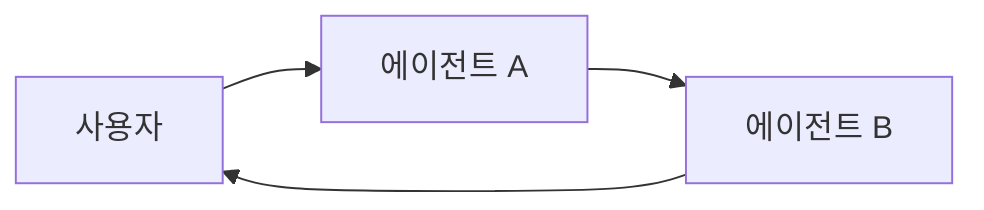

import AlphaCallout from '/snippets/alpha-lc-callout.mdx';

<AlphaCallout />

**멀티 에이전트 시스템**은 복잡한 애플리케이션을 함께 작동하여 문제를 해결하는 여러 특화된 에이전트로 분할합니다.
모든 단계를 처리하는 단일 에이전트에 의존하는 대신, **멀티 에이전트 아키텍처**를 사용하면 더 작고 집중된 에이전트를 조정된 워크플로로 구성할 수 있습니다.

멀티 에이전트 시스템은 다음과 같은 경우에 유용합니다:

* 단일 에이전트가 너무 많은 도구를 가지고 있어 어떤 것을 사용할지 잘못된 결정을 내리는 경우.
* 컨텍스트나 메모리가 하나의 에이전트가 효과적으로 추적하기에 너무 큰 경우.
* 작업에 **전문화**가 필요한 경우(예: 플래너, 연구원, 수학 전문가).

## 멀티 에이전트 패턴

| 패턴                           | 작동 방식                                                                                                                                                     | 제어 흐름                                               | 사용 사례 예시                                 |
|-----------------------------------|------------------------------------------------------------------------------------------------------------------------------------------------------------------|------------------------------------------------------------|--------------------------------------------------|
| [**도구 호출**](#tool-calling) | **슈퍼바이저** 에이전트가 다른 에이전트를 *도구*로 호출합니다. "도구" 에이전트는 사용자와 직접 대화하지 않고 작업을 실행하고 결과를 반환하기만 합니다.                  | 중앙집중식: 모든 라우팅이 호출 에이전트를 거칩니다. | 작업 오케스트레이션, 구조화된 워크플로.        |
| [**핸드오프**](#handoffs)         | 현재 에이전트가 다른 에이전트로 **제어를 전달**하기로 결정합니다. 활성 에이전트가 변경되며, 사용자는 새 에이전트와 직접 계속 상호작용할 수 있습니다. | 분산형: 에이전트가 활성 상태인 에이전트를 변경할 수 있습니다.            | 멀티 도메인 대화, 전문가 인수인계. |

<Card
    title="튜토리얼: 슈퍼바이저 에이전트 구축하기"
    icon="sitemap"
    href="/oss/javascript/langchain/supervisor"
    arrow cta="자세히 알아보기"
>
    중앙 슈퍼바이저 에이전트가 특화된 워커 에이전트를 조정하는 슈퍼바이저 패턴을 사용하여 개인 비서를 구축하는 방법을 배워보세요.
    이 튜토리얼에서 다루는 내용:
    * 다양한 도메인(캘린더 및 이메일)을 위한 특화된 하위 에이전트 생성
    * 중앙집중식 오케스트레이션을 위한 도구로 하위 에이전트 래핑
    * 민감한 작업에 대한 사람 개입 검토 추가
</Card>


## 패턴 선택하기

| 질문                                              | 도구 호출 | 핸드오프 |
|-------------------------------------------------------|--------------|----------|
| 워크플로에 대한 중앙집중식 제어가 필요한가?               | ✅ 예        | ❌ 아니오     |
| 에이전트가 사용자와 직접 상호작용하기를 원하는가?       | ❌ 아니오         | ✅ 예    |
| 전문가 간의 복잡하고 인간적인 대화?               | ❌ 제한적    | ✅ 강력함 |

<Tip>
    두 패턴을 혼합할 수 있습니다 - 에이전트 전환에는 **핸드오프**를 사용하고, 각 에이전트가 특화된 작업을 위해 **하위 에이전트를 도구로 호출**하도록 할 수 있습니다.
</Tip>

## 에이전트 컨텍스트 커스터마이징

멀티 에이전트 설계의 핵심은 **컨텍스트 엔지니어링**입니다 - 각 에이전트가 어떤 정보를 보는지 결정하는 것입니다. LangChain은 다음에 대한 세밀한 제어를 제공합니다:

* 대화 또는 상태의 어떤 부분이 각 에이전트에 전달되는지.
* 하위 에이전트에 맞춤화된 특화된 프롬프트.
* 중간 추론의 포함/제외.
* 에이전트별 입력/출력 형식 커스터마이징.

시스템의 품질은 컨텍스트 엔지니어링에 **크게 의존**합니다. 목표는 각 에이전트가 도구로 작동하든 활성 에이전트로 작동하든 작업을 수행하는 데 필요한 올바른 데이터에 접근할 수 있도록 하는 것입니다.

## 도구 호출

**도구 호출**에서는 하나의 에이전트("**컨트롤러**")가 다른 에이전트를 필요할 때 호출할 *도구*로 취급합니다. 컨트롤러는 오케스트레이션을 관리하고, 도구 에이전트는 특정 작업을 수행하고 결과를 반환합니다.

흐름:

1. **컨트롤러**가 입력을 받고 어떤 도구(하위 에이전트)를 호출할지 결정합니다.
2. **도구 에이전트**가 컨트롤러의 지시에 따라 작업을 실행합니다.
3. **도구 에이전트**가 컨트롤러에 결과를 반환합니다.
4. **컨트롤러**가 다음 단계를 결정하거나 종료합니다.


```mermaid
graph LR
    A[사용자] --> B[컨트롤러 에이전트]
    B --> C[도구 에이전트 1]
    B --> D[도구 에이전트 2]
    C --> B
    D --> B
    B --> E[사용자 응답]
````

<Tip>
    도구로 사용되는 에이전트는 일반적으로 사용자와 대화를 계속하는 것이 **예상되지 않습니다**.
    그들의 역할은 작업을 수행하고 컨트롤러 에이전트에 결과를 반환하는 것입니다.
    하위 에이전트가 사용자와 대화할 수 있어야 하는 경우 대신 **핸드오프**를 사용하세요.
</Tip>

### 구현

아래는 메인 에이전트에 도구 정의를 통해 단일 하위 에이전트에 대한 접근 권한이 부여되는 최소한의 예시입니다:


```typescript
import { createAgent, tool } from "langchain";
import * as z from "zod";

const subagent1 = createAgent({...});

const callSubagent1 = tool(
  async ({ query }) => {
    const result = await subagent1.invoke({
      messages: [{ role: "user", content: query }]
    });
    return result.messages.at(-1)?.text;
  },
  {
    name: "subagent1_name",
    description: "subagent1_description",
    schema: z.object({
      query: z.string().describe("The query to to send to subagent1."),
    }),
  }
);

const agent = createAgent({
  model,
  tools: [callSubagent1]
});
```


이 패턴에서:
1. 메인 에이전트는 작업이 하위 에이전트의 설명과 일치한다고 판단할 때 `call_subagent1`을 호출합니다.
2. 하위 에이전트가 독립적으로 실행되고 결과를 반환합니다.
3. 메인 에이전트가 결과를 받고 오케스트레이션을 계속합니다.

### 커스터마이징 위치

메인 에이전트와 하위 에이전트 간에 컨텍스트가 전달되는 방식을 제어할 수 있는 여러 지점이 있습니다:

1. **하위 에이전트 이름** (`"subagent1_name"`): 메인 에이전트가 하위 에이전트를 참조하는 방식입니다. 프롬프팅에 영향을 미치므로 신중하게 선택하세요.
2. **하위 에이전트 설명** (`"subagent1_description"`): 메인 에이전트가 하위 에이전트에 대해 "아는" 것입니다. 메인 에이전트가 언제 호출할지 결정하는 방식을 직접적으로 형성합니다.
3. **하위 에이전트에 대한 입력**: 이 입력을 커스터마이징하여 하위 에이전트가 작업을 해석하는 방식을 더 잘 형성할 수 있습니다. 위의 예시에서는 에이전트가 생성한 `query`를 직접 전달합니다.
4. **하위 에이전트로부터의 출력**: 메인 에이전트에 다시 전달되는 **응답**입니다. 메인 에이전트가 결과를 해석하는 방식을 제어하기 위해 반환되는 내용을 조정할 수 있습니다. 위의 예시에서는 최종 메시지 텍스트를 반환하지만, 추가 상태나 메타데이터를 반환할 수도 있습니다.

### 하위 에이전트에 대한 입력 제어

메인 에이전트가 하위 에이전트에 전달하는 입력을 제어하는 두 가지 주요 레버가 있습니다:

* **프롬프트 수정** – 메인 에이전트의 프롬프트 또는 도구 메타데이터(즉, 하위 에이전트의 이름 및 설명)를 조정하여 하위 에이전트를 언제 어떻게 호출할지 더 잘 안내합니다.
* **컨텍스트 주입** – 정적 프롬프트로 캡처하기에는 실용적이지 않은 입력(예: 전체 메시지 기록, 이전 결과, 작업 메타데이터)을 에이전트의 상태에서 가져오도록 도구 호출을 조정하여 추가합니다.


```typescript
import { createAgent, tool, AgentState, ToolMessage } from "langchain";
import { Command } from "@langchain/langgraph";
import * as z from "zod";

// 상태를 통해 전체 대화 기록을 하위 에이전트에 전달하는 예시입니다.
const callSubagent1 = tool(
  async ({query}) => {
    const state = getCurrentTaskInput<AgentState>();
    // 메시지를 적절한 입력으로 변환하는 데 필요한 로직을 적용합니다
    const subAgentInput = someLogic(query, state.messages);
    const result = await subagent1.invoke({
      messages: subAgentInput,
      // 필요에 따라 다른 상태 키를 여기에 전달할 수도 있습니다.
      // 메인 및 하위 에이전트의 상태 스키마 모두에 정의해야 합니다.
      exampleStateKey: state.exampleStateKey
    });
    return result.messages.at(-1)?.content;
  },
  {
    name: "subagent1_name",
    description: "subagent1_description",
  }
);
```


### 하위 에이전트로부터의 출력 제어

메인 에이전트가 하위 에이전트로부터 받는 내용을 형성하는 두 가지 일반적인 전략:

* **프롬프트 수정** – 하위 에이전트의 프롬프트를 개선하여 정확히 무엇을 반환해야 하는지 지정합니다.
  * 출력이 불완전하거나, 너무 장황하거나, 핵심 세부 정보가 누락된 경우에 유용합니다.
  * 일반적인 실패 모드는 하위 에이전트가 도구 호출이나 추론을 수행하지만 최종 메시지에 **결과를 포함하지 않는** 것입니다. 컨트롤러(및 사용자)는 최종 출력만 보므로 모든 관련 정보가 거기에 포함되어야 한다는 것을 상기시켜주세요.
* **커스텀 출력 형식** – 메인 에이전트에 다시 전달하기 전에 코드에서 하위 에이전트의 응답을 조정하거나 강화합니다.
  * 예시: 최종 텍스트 외에 특정 상태 키를 메인 에이전트에 다시 전달합니다.
  * 이를 위해서는 결과를 `Command`(또는 동등한 구조)로 래핑하여 커스텀 상태를 하위 에이전트의 응답과 병합할 수 있어야 합니다.


```typescript
import { tool, ToolMessage } from "langchain";
import { Command } from "@langchain/langgraph";
import * as z from "zod";

const callSubagent1 = tool(
  async ({ query }, config) => {
    const result = await subagent1.invoke({
      messages: [{ role: "user", content: query }]
    });

    // 여러 상태 키를 업데이트하려면 Command를 반환합니다
    return new Command({
      update: {
        // 하위 에이전트로부터 추가 상태를 다시 전달합니다
        exampleStateKey: result.exampleStateKey,
        messages: [
          new ToolMessage({
            content: result.messages.at(-1)?.text,
            tool_call_id: config.toolCall?.id!
          })
        ]
      }
    });
  },
  {
    name: "subagent1_name",
    description: "subagent1_description",
    schema: z.object({
      query: z.string().describe("The query to send to subagent1")
    })
  }
);
```


## 핸드오프

**핸드오프**에서는 에이전트가 서로 직접 제어를 전달할 수 있습니다. "활성" 에이전트가 변경되며, 사용자는 현재 제어권을 가진 에이전트와 상호작용합니다.

흐름:

1. **현재 에이전트**가 다른 에이전트의 도움이 필요하다고 결정합니다.
2. 제어(및 상태)를 **다음 에이전트**로 전달합니다.
3. **새 에이전트**가 다시 핸드오프하거나 종료하기로 결정할 때까지 사용자와 직접 상호작용합니다.




### 구현 (곧 제공 예정)

---

<Callout icon="pen-to-square" iconType="regular">
    [Edit the source of this page on GitHub.](https://github.com/langchain-ai/docs/edit/main/src/oss/langchain/multi-agent.mdx)
</Callout>
<Tip icon="terminal" iconType="regular">
    [Connect these docs programmatically](/use-these-docs) to Claude, VSCode, and more via MCP for    real-time answers.
</Tip>
