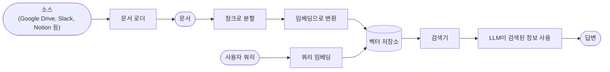
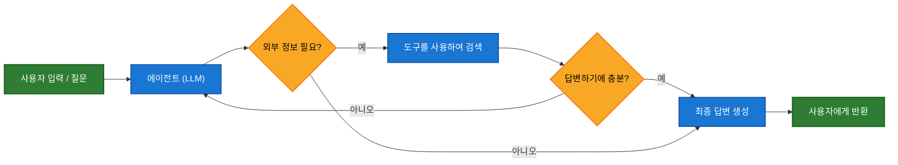
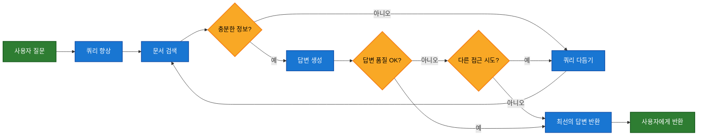

대규모 언어 모델(LLM)은 강력하지만, 두 가지 핵심적인 제약이 있습니다:

* **제한된 컨텍스트** — 전체 말뭉치를 한 번에 처리할 수 없습니다.
* **정적 지식** — 훈련 데이터가 특정 시점에 고정되어 있습니다.

검색은 쿼리 시점에 관련 외부 지식을 가져옴으로써 이러한 문제를 해결합니다. 이것이 바로 **검색 증강 생성(RAG)**의 기초입니다: 컨텍스트 특화 정보로 LLM의 답변을 향상시키는 것입니다.


## 지식 베이스 구축하기

**지식 베이스**는 검색 중에 사용되는 문서 또는 구조화된 데이터의 저장소입니다.

사용자 정의 지식 베이스가 필요한 경우, LangChain의 문서 로더와 벡터 저장소를 사용하여 자신의 데이터로 지식 베이스를 구축할 수 있습니다.

<Note>
    이미 지식 베이스(예: SQL 데이터베이스, CRM 또는 내부 문서 시스템)가 있는 경우, 다시 구축할 필요가 **없습니다**. 다음과 같이 할 수 있습니다:
    - 에이전틱 RAG에서 에이전트의 **도구**로 연결합니다.
    - 쿼리하여 검색된 내용을 LLM에 컨텍스트로 제공합니다 [(2단계 RAG)](#2-step-rag).
</Note>

검색 가능한 지식 베이스와 최소한의 RAG 워크플로우를 구축하려면 다음 튜토리얼을 참조하세요:

<Card
    title="튜토리얼: 시맨틱 검색"
    icon="database"
    href="/oss/javascript/langchain/knowledge-base"
    arrow cta="더 알아보기"
>
    LangChain의 문서 로더, 임베딩, 벡터 저장소를 사용하여 자신의 데이터로 검색 가능한 지식 베이스를 만드는 방법을 배웁니다.
    이 튜토리얼에서는 PDF에 대한 검색 엔진을 구축하여 쿼리와 관련된 구절을 검색할 수 있도록 합니다. 또한 이 엔진 위에 최소한의 RAG 워크플로우를 구현하여 외부 지식이 LLM 추론에 어떻게 통합될 수 있는지 확인합니다.
</Card>

### 검색에서 RAG로

검색은 LLM이 런타임에 관련 컨텍스트에 접근할 수 있게 합니다. 하지만 대부분의 실제 애플리케이션은 한 단계 더 나아갑니다: **검색과 생성을 통합**하여 근거가 있고 컨텍스트를 인식하는 답변을 생성합니다.

이것이 바로 **검색 증강 생성(RAG)**의 핵심 아이디어입니다. 검색 파이프라인은 검색과 생성을 결합하는 더 넓은 시스템의 기반이 됩니다.

### 검색 파이프라인

일반적인 검색 워크플로우는 다음과 같습니다:



각 구성 요소는 모듈식입니다: 앱의 로직을 다시 작성하지 않고도 로더, 스플리터, 임베딩 또는 벡터 저장소를 교체할 수 있습니다.

### 구성 요소

<Columns cols={2}>
    <Card
        title="문서 로더"
        icon="file-import"
        href="/oss/javascript/integrations/document_loaders"
        arrow cta="더 알아보기"
    >
        외부 소스(Google Drive, Slack, Notion 등)에서 데이터를 수집하여 표준화된 [`Document`](https://v03.api.js.langchain.com/classes/_langchain_core.documents.Document.html) 객체를 반환합니다.
    </Card>


    <Card
        title="임베딩 모델"
        icon="diagram-project"
        href="/oss/javascript/integrations/text_embedding"
        arrow
        cta="더 알아보기"
    >
        임베딩 모델은 텍스트를 숫자 벡터로 변환하여 유사한 의미를 가진 텍스트가 벡터 공간에서 가까이 위치하도록 합니다.
    </Card>

    <Card
        title="벡터 저장소"
        icon="database"
        href="/oss/javascript/integrations/vectorstores/"
        arrow
        cta="더 알아보기"
    >
        임베딩을 저장하고 검색하기 위한 전문 데이터베이스입니다.
    </Card>

    <Card
        title="검색기"
        icon="binoculars"
        href="/oss/javascript/integrations/retrievers/"
        arrow
        cta="더 알아보기"
    >
        검색기는 비구조화된 쿼리를 받아 문서를 반환하는 인터페이스입니다.
    </Card>
</Columns>

## RAG 아키텍처

RAG는 시스템의 요구 사항에 따라 여러 방식으로 구현될 수 있습니다. 아래 섹션에서 각 유형을 설명합니다.

| 아키텍처            | 설명                                                                | 제어   | 유연성 | 지연 시간        | 사용 사례 예시                                   |
|-------------------------|----------------------------------------------------------------------------|-----------|-------------|----------------|----------------------------------------------------|
| **2단계 RAG**          | 검색이 항상 생성 전에 발생합니다. 간단하고 예측 가능합니다         | ✅ 높음    | ❌ 낮음       | ⚡ 빠름         | FAQ, 문서 봇                           |
| **에이전틱 RAG**         | LLM 기반 에이전트가 추론 중 *언제* 그리고 *어떻게* 검색할지 결정합니다 | ❌ 낮음     | ✅ 높음      | ⏳ 가변     | 여러 도구에 접근 가능한 연구 어시스턴트  |
| **하이브리드**              | 검증 단계를 포함하여 두 접근 방식의 특성을 결합합니다          | ⚖️ 중간 | ⚖️ 중간   | ⏳ 가변     | 품질 검증이 있는 도메인 특화 Q&A        |

<Info>
**지연 시간**: 지연 시간은 일반적으로 **2단계 RAG**에서 더 **예측 가능**합니다. LLM 호출의 최대 횟수가 알려져 있고 제한되어 있기 때문입니다. 이 예측 가능성은 LLM 추론 시간이 지배적인 요소라고 가정합니다. 그러나 실제 지연 시간은 API 응답 시간, 네트워크 지연 또는 데이터베이스 쿼리와 같은 검색 단계의 성능에 의해서도 영향을 받을 수 있으며, 사용 중인 도구와 인프라에 따라 달라질 수 있습니다.
</Info>

### 2단계 RAG

**2단계 RAG**에서는 검색 단계가 항상 생성 단계 전에 실행됩니다. 이 아키텍처는 간단하고 예측 가능하여 관련 문서 검색이 답변 생성의 명확한 전제 조건인 많은 애플리케이션에 적합합니다.


<Card
    title="튜토리얼: 검색 증강 생성(RAG)"
    icon="robot"
    href="/oss/javascript/langchain/rag#rag-chains"
    arrow cta="더 알아보기"
>
    검색 증강 생성을 사용하여 데이터에 기반한 질문에 답변할 수 있는 Q&A 챗봇을 구축하는 방법을 확인하세요.
    이 튜토리얼은 두 가지 접근 방식을 안내합니다:
    * 유연한 도구로 검색을 실행하는 **RAG 에이전트** — 범용 사용에 적합합니다.
    * 쿼리당 하나의 LLM 호출만 필요한 **2단계 RAG** 체인 — 간단한 작업에 빠르고 효율적입니다.
</Card>

### 에이전틱 RAG

**에이전틱 검색 증강 생성(RAG)**은 검색 증강 생성의 강점과 에이전트 기반 추론을 결합합니다. 답변하기 전에 문서를 검색하는 대신, (LLM이 구동하는) 에이전트가 단계별로 추론하며 상호작용 중 **언제** 그리고 **어떻게** 정보를 검색할지 결정합니다.

<Tip>
에이전트가 RAG 동작을 활성화하기 위해 필요한 것은 외부 지식을 가져올 수 있는 하나 이상의 **도구**에 대한 접근뿐입니다 — 문서 로더, 웹 API 또는 데이터베이스 쿼리와 같은 도구입니다.
</Tip>




```typescript
import { tool, createAgent, initChatModel } from "langchain";

const fetchUrl = tool(
    (url: string) => {
        return `Fetched content from ${url}`;
    },
    { name: "fetch_url", description: "Fetch text content from a URL" }
);

const agent = createAgent({
    model: "claude-sonnet-4-0",
    tools: [fetchUrl],
    systemPrompt,
});
```


<Expandable title="확장 예제: LangGraph의 llms.txt를 위한 에이전틱 RAG">

이 예제는 사용자가 LangGraph 문서를 쿼리하는 것을 돕기 위한 **에이전틱 RAG 시스템**을 구현합니다. 에이전트는 사용 가능한 문서 URL을 나열하는 [llms.txt](https://llmstxt.org/)를 로드하는 것으로 시작하며, 사용자의 질문에 따라 `fetch_documentation` 도구를 동적으로 사용하여 관련 콘텐츠를 검색하고 처리할 수 있습니다.


```typescript
import { tool, createAgent, initChatModel, HumanMessage } from "langchain";
import * as z from "zod";

const ALLOWED_DOMAINS = ["https://langchain-ai.github.io/"];
const LLMS_TXT = "https://langchain-ai.github.io/langgraph/llms.txt";

const fetchDocumentation = tool(
  async (input) => {  // [!code highlight]
    if (!ALLOWED_DOMAINS.some((domain) => input.url.startsWith(domain))) {
      return `오류: URL이 허용되지 않습니다. 다음 중 하나로 시작해야 합니다: ${ALLOWED_DOMAINS.join(", ")}`;
    }
    const response = await fetch(input.url);
    if (!response.ok) {
      throw new Error(`HTTP error! status: ${response.status}`);
    }
    return response.text();
  },
  {
    name: "fetch_documentation",
    description: "Fetch and convert documentation from a URL",
    schema: z.object({
      url: z.string().describe("The URL of the documentation to fetch"),
    }),
  }
);

const llmsTxtResponse = await fetch(LLMS_TXT);
const llmsTxtContent = await llmsTxtResponse.text();

const systemPrompt = `
당신은 전문 TypeScript 개발자이자 기술 어시스턴트입니다.
당신의 주요 역할은 LangGraph 및 관련 도구에 대한 사용자의 질문을 돕는 것입니다.

지침:

1. 사용자가 확실하지 않은 질문을 하거나 — API 사용, 동작 또는 구성과 관련될 가능성이 있는 질문을 하면,
   관련 문서를 참조하기 위해 \`fetch_documentation\` 도구를 반드시 사용해야 합니다.
2. 문서를 인용할 때는 명확하게 요약하고 콘텐츠에서 관련 컨텍스트를 포함하세요.
3. 허용된 도메인 외부의 URL을 사용하지 마세요.
4. 문서 가져오기가 실패하면 사용자에게 알리고 최선의 전문 지식으로 진행하세요.

다음 승인된 소스에서 공식 문서에 접근할 수 있습니다:

${llmsTxtContent}

사용자의 LangGraph에 대한 질문에 답변하기 전에 최신 문서를 참조하기 위해
문서를 반드시 확인해야 합니다.

답변은 명확하고 간결하며 기술적으로 정확해야 합니다.
`;

const tools = [fetchDocumentation];

const agent = createAgent({
  model: "claude-sonnet-4-0"
  tools,  // [!code highlight]
  systemPrompt,  // [!code highlight]
  name: "Agentic RAG",
});

const response = await agent.invoke({
  messages: [
    new HumanMessage(
      "사전 구축된 create react agent를 사용하는 langgraph 에이전트의 " +
      "짧은 예제를 작성하세요. 에이전트는 주식 가격 정보를 " +
      "조회할 수 있어야 합니다."
    ),
  ],
});

console.log(response.messages.at(-1)?.content);
```

</Expandable>

<Card
    title="튜토리얼: 검색 증강 생성(RAG)"
    icon="robot"
    href="/oss/javascript/langchain/rag"
    arrow cta="더 알아보기"
>
    검색 증강 생성을 사용하여 데이터에 기반한 질문에 답변할 수 있는 Q&A 챗봇을 구축하는 방법을 확인하세요.
    이 튜토리얼은 두 가지 접근 방식을 안내합니다:
    * 유연한 도구로 검색을 실행하는 **RAG 에이전트** — 범용 사용에 적합합니다.
    * 쿼리당 하나의 LLM 호출만 필요한 **2단계 RAG** 체인 — 간단한 작업에 빠르고 효율적입니다.
</Card>

### 하이브리드 RAG

하이브리드 RAG는 2단계와 에이전틱 RAG의 특성을 결합합니다. 쿼리 전처리, 검색 검증, 생성 후 검사와 같은 중간 단계를 도입합니다. 이러한 시스템은 고정 파이프라인보다 더 많은 유연성을 제공하면서 실행에 대한 어느 정도의 제어를 유지합니다.

일반적인 구성 요소는 다음과 같습니다:

* **쿼리 향상**: 검색 품질을 향상시키기 위해 입력 질문을 수정합니다. 불분명한 쿼리를 다시 작성하거나, 여러 변형을 생성하거나, 추가 컨텍스트로 쿼리를 확장하는 것이 포함될 수 있습니다.
* **검색 검증**: 검색된 문서가 관련성이 있고 충분한지 평가합니다. 그렇지 않으면 시스템이 쿼리를 다듬고 다시 검색할 수 있습니다.
* **답변 검증**: 생성된 답변의 정확성, 완전성, 소스 콘텐츠와의 일치도를 확인합니다. 필요한 경우 시스템이 답변을 재생성하거나 수정할 수 있습니다.

아키텍처는 종종 이러한 단계 간 여러 반복을 지원합니다:



이 아키텍처는 다음에 적합합니다:

* 모호하거나 불충분하게 지정된 쿼리가 있는 애플리케이션
* 검증 또는 품질 제어 단계가 필요한 시스템
* 여러 소스 또는 반복적 개선을 포함하는 워크플로우

<Card
    title="튜토리얼: 자기 수정이 있는 에이전틱 RAG"
    icon="robot"
    href="/oss/javascript/langgraph/agentic-rag"
    arrow cta="더 알아보기"
>
    에이전틱 추론과 검색 및 자기 수정을 결합한 **하이브리드 RAG**의 예제입니다.
</Card>

---

<Callout icon="pen-to-square" iconType="regular">
  [Edit the source of this page on GitHub](https://github.com/langchain-ai/docs/edit/main/src/oss/langchain/retrieval.mdx)
</Callout>
