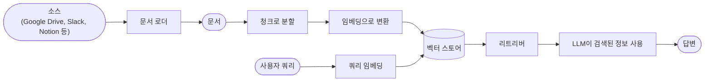
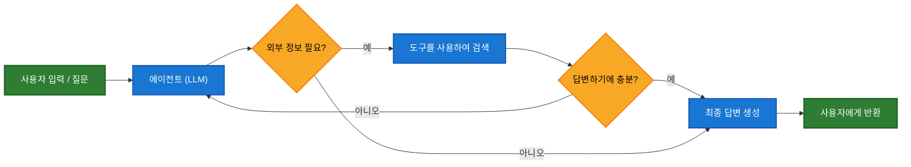
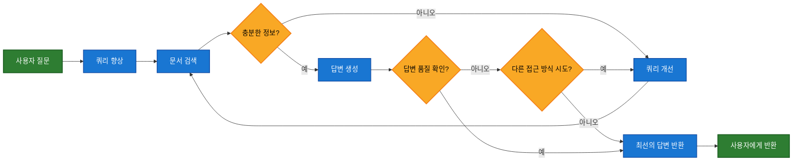

대규모 언어 모델(LLM)은 강력하지만 두 가지 주요 제약이 있습니다:

* **제한된 컨텍스트** — 전체 말뭉치를 한 번에 처리할 수 없습니다.
* **정적 지식** — 학습 데이터가 특정 시점에 고정되어 있습니다.

검색(Retrieval)은 쿼리 시점에 관련 외부 지식을 가져옴으로써 이러한 문제를 해결합니다. 이것이 바로 **검색 증강 생성(RAG)**의 기초입니다: 컨텍스트 특정 정보로 LLM의 답변을 향상시키는 것입니다.


## 지식 베이스 구축

**지식 베이스**는 검색 중에 사용되는 문서 또는 구조화된 데이터의 저장소입니다.

사용자 정의 지식 베이스가 필요한 경우, LangChain의 문서 로더와 벡터 스토어를 사용하여 자체 데이터로부터 구축할 수 있습니다.

<Note>
    이미 지식 베이스(예: SQL 데이터베이스, CRM 또는 내부 문서 시스템)가 있는 경우, 이를 다시 구축할 필요가 **없습니다**. 다음과 같이 할 수 있습니다:
    - Agentic RAG의 에이전트를 위한 **도구**로 연결합니다.
    - 쿼리하고 검색된 콘텐츠를 LLM에 컨텍스트로 제공합니다 [(2단계 RAG)](#2-step-rag).
</Note>

다음 튜토리얼에서 검색 가능한 지식 베이스와 최소한의 RAG 워크플로우를 구축하는 방법을 확인하세요:

<Card
    title="튜토리얼: 시맨틱 검색"
    icon="database"
    href="/oss/python/langchain/knowledge-base"
    arrow cta="자세히 알아보기"
>
    LangChain의 문서 로더, 임베딩 및 벡터 스토어를 사용하여 자체 데이터로부터 검색 가능한 지식 베이스를 생성하는 방법을 배웁니다.
    이 튜토리얼에서는 PDF에 대한 검색 엔진을 구축하여 쿼리와 관련된 구절을 검색할 수 있도록 합니다. 또한 이 엔진 위에 최소한의 RAG 워크플로우를 구현하여 외부 지식이 LLM 추론에 어떻게 통합될 수 있는지 확인합니다.
</Card>

### 검색에서 RAG로

검색을 통해 LLM은 런타임에 관련 컨텍스트에 액세스할 수 있습니다. 그러나 대부분의 실제 애플리케이션은 한 단계 더 나아갑니다: **검색과 생성을 통합**하여 근거가 있고 컨텍스트를 인식하는 답변을 생성합니다.

이것이 **검색 증강 생성(RAG)**의 핵심 개념입니다. 검색 파이프라인은 검색과 생성을 결합하는 더 광범위한 시스템의 기초가 됩니다.

### 검색 파이프라인

일반적인 검색 워크플로우는 다음과 같습니다:



각 구성 요소는 모듈식입니다: 앱의 로직을 다시 작성하지 않고도 로더, 스플리터, 임베딩 또는 벡터 스토어를 교체할 수 있습니다.

### 구성 요소

<Columns cols={2}>
    <Card
        title="문서 로더"
        icon="file-import"
        href="/oss/python/integrations/document_loaders"
        arrow cta="자세히 알아보기"
    >
        외부 소스(Google Drive, Slack, Notion 등)에서 데이터를 수집하여 표준화된 [`Document`](https://reference.langchain.com/python/langchain_core/documents/#langchain_core.documents.base.Document) 객체를 반환합니다.
    </Card>

    <Card
        title="텍스트 스플리터"
        icon="scissors"
        href="/oss/python/integrations/splitters"
        arrow
        cta="자세히 알아보기"
    >
        큰 문서를 개별적으로 검색 가능하고 모델의 컨텍스트 윈도우에 맞는 작은 청크로 나눕니다.
    </Card>

    <Card
        title="임베딩 모델"
        icon="diagram-project"
        href="/oss/python/integrations/text_embedding"
        arrow
        cta="자세히 알아보기"
    >
        임베딩 모델은 텍스트를 숫자 벡터로 변환하여 유사한 의미를 가진 텍스트가 해당 벡터 공간에서 가까이 위치하도록 합니다.
    </Card>

    <Card
        title="벡터 스토어"
        icon="database"
        href="/oss/python/integrations/vectorstores/"
        arrow
        cta="자세히 알아보기"
    >
        임베딩을 저장하고 검색하기 위한 특수 데이터베이스입니다.
    </Card>

    <Card
        title="리트리버"
        icon="binoculars"
        href="/oss/python/integrations/retrievers/"
        arrow
        cta="자세히 알아보기"
    >
        리트리버는 비구조화된 쿼리가 주어지면 문서를 반환하는 인터페이스입니다.
    </Card>
</Columns>

## RAG 아키텍처

RAG는 시스템의 요구 사항에 따라 여러 방식으로 구현될 수 있습니다. 각 유형을 아래 섹션에서 설명합니다.

| 아키텍처            | 설명                                                                | 제어   | 유연성 | 지연 시간        | 사용 사례 예시                                   |
|-------------------------|----------------------------------------------------------------------------|-----------|-------------|----------------|----------------------------------------------------|
| **2단계 RAG**          | 검색이 항상 생성 전에 발생합니다. 단순하고 예측 가능합니다         | ✅ 높음    | ❌ 낮음       | ⚡ 빠름         | FAQ, 문서 봇                           |
| **Agentic RAG**         | LLM 기반 에이전트가 추론 중 *언제* 그리고 *어떻게* 검색할지 결정합니다 | ❌ 낮음     | ✅ 높음      | ⏳ 가변적     | 여러 도구에 액세스할 수 있는 연구 도우미  |
| **하이브리드**              | 검증 단계를 포함하여 두 접근 방식의 특성을 결합합니다          | ⚖️ 중간 | ⚖️ 중간   | ⏳ 가변적     | 품질 검증을 포함한 도메인별 Q&A        |

<Info>
**지연 시간**: 지연 시간은 일반적으로 **2단계 RAG**에서 더 **예측 가능**합니다. 최대 LLM 호출 횟수가 알려져 있고 제한되어 있기 때문입니다. 이러한 예측 가능성은 LLM 추론 시간이 지배적인 요인이라고 가정합니다. 그러나 실제 지연 시간은 검색 단계의 성능(예: API 응답 시간, 네트워크 지연 또는 데이터베이스 쿼리)에도 영향을 받을 수 있으며, 이는 사용 중인 도구와 인프라에 따라 달라질 수 있습니다.
</Info>

### 2단계 RAG

**2단계 RAG**에서는 검색 단계가 항상 생성 단계 전에 실행됩니다. 이 아키텍처는 간단하고 예측 가능하여 관련 문서 검색이 답변 생성을 위한 명확한 전제 조건인 많은 애플리케이션에 적합합니다.


<Card
    title="튜토리얼: 검색 증강 생성(RAG)"
    icon="robot"
    href="/oss/python/langchain/rag#rag-chains"
    arrow cta="자세히 알아보기"
>
    검색 증강 생성을 사용하여 데이터에 기반한 질문에 답변할 수 있는 Q&A 챗봇을 구축하는 방법을 확인하세요.
    이 튜토리얼은 두 가지 접근 방식을 안내합니다:
    * 유연한 도구로 검색을 실행하는 **RAG 에이전트** - 범용 사용에 적합합니다.
    * 쿼리당 하나의 LLM 호출만 필요한 **2단계 RAG** 체인 - 간단한 작업에 빠르고 효율적입니다.
</Card>

### Agentic RAG

**Agentic 검색 증강 생성(RAG)**은 검색 증강 생성의 강점과 에이전트 기반 추론을 결합합니다. 답변하기 전에 문서를 검색하는 대신, (LLM으로 구동되는) 에이전트가 단계별로 추론하고 상호작용 중 **언제** 그리고 **어떻게** 정보를 검색할지 결정합니다.

<Tip>
에이전트가 RAG 동작을 활성화하기 위해 필요한 것은 외부 지식을 가져올 수 있는 하나 이상의 **도구**에 대한 액세스뿐입니다 — 예를 들어 문서 로더, 웹 API 또는 데이터베이스 쿼리 등입니다.
</Tip>



```python
import requests
from langchain.tools import tool
from langchain.chat_models import init_chat_model
from langchain.agents import create_agent


@tool
def fetch_url(url: str) -> str:
    """Fetch text content from a URL"""
    response = requests.get(url, timeout=10.0)
    response.raise_for_status()
    return response.text

system_prompt = """\
Use fetch_url when you need to fetch information from a web-page; quote relevant snippets.
"""

agent = create_agent(
    model="claude-sonnet-4-0",
    tools=[fetch_url], # A tool for retrieval [!code highlight]
    system_prompt=system_prompt,
)
```


<Expandable title="확장 예제: LangGraph의 llms.txt를 위한 Agentic RAG">

이 예제는 사용자가 LangGraph 문서를 쿼리하는 데 도움을 주기 위한 **Agentic RAG 시스템**을 구현합니다. 에이전트는 사용 가능한 문서 URL을 나열하는 [llms.txt](https://llmstxt.org/)를 로드하는 것으로 시작하며, 그 후 사용자의 질문에 따라 관련 콘텐츠를 검색하고 처리하기 위해 `fetch_documentation` 도구를 동적으로 사용할 수 있습니다.

```python
import requests
from langchain.agents import create_agent
from langchain.messages import HumanMessage
from langchain.tools import tool
from markdownify import markdownify


ALLOWED_DOMAINS = ["https://langchain-ai.github.io/"]
LLMS_TXT = 'https://langchain-ai.github.io/langgraph/llms.txt'


@tool
def fetch_documentation(url: str) -> str:  # [!code highlight]
    """Fetch and convert documentation from a URL"""
    if not any(url.startswith(domain) for domain in ALLOWED_DOMAINS):
        return (
            "Error: URL not allowed. "
            f"Must start with one of: {', '.join(ALLOWED_DOMAINS)}"
        )
    response = requests.get(url, timeout=10.0)
    response.raise_for_status()
    return markdownify(response.text)


# We will fetch the content of llms.txt, so this can
# be done ahead of time without requiring an LLM request.
llms_txt_content = requests.get(LLMS_TXT).text

# System prompt for the agent
system_prompt = f"""
You are an expert Python developer and technical assistant.
Your primary role is to help users with questions about LangGraph and related tools.

Instructions:

1. If a user asks a question you're unsure about — or one that likely involves API usage,
   behavior, or configuration — you MUST use the `fetch_documentation` tool to consult the relevant docs.
2. When citing documentation, summarize clearly and include relevant context from the content.
3. Do not use any URLs outside of the allowed domain.
4. If a documentation fetch fails, tell the user and proceed with your best expert understanding.

You can access official documentation from the following approved sources:

{llms_txt_content}

You MUST consult the documentation to get up to date documentation
before answering a user's question about LangGraph.

Your answers should be clear, concise, and technically accurate.
"""

tools = [fetch_documentation]

model = init_chat_model("claude-sonnet-4-0", max_tokens=32_000)

agent = create_agent(
    model=model,
    tools=tools,  # [!code highlight]
    system_prompt=system_prompt,  # [!code highlight]
    name="Agentic RAG",
)

response = agent.invoke({
    'messages': [
        HumanMessage(content=(
            "Write a short example of a langgraph agent using the "
            "prebuilt create react agent. the agent should be able "
            "to look up stock pricing information."
        ))
    ]
})

print(response['messages'][-1].content)
```


</Expandable>

<Card
    title="튜토리얼: 검색 증강 생성(RAG)"
    icon="robot"
    href="/oss/python/langchain/rag"
    arrow cta="자세히 알아보기"
>
    검색 증강 생성을 사용하여 데이터에 기반한 질문에 답변할 수 있는 Q&A 챗봇을 구축하는 방법을 확인하세요.
    이 튜토리얼은 두 가지 접근 방식을 안내합니다:
    * 유연한 도구로 검색을 실행하는 **RAG 에이전트** - 범용 사용에 적합합니다.
    * 쿼리당 하나의 LLM 호출만 필요한 **2단계 RAG** 체인 - 간단한 작업에 빠르고 효율적입니다.
</Card>

### 하이브리드 RAG

하이브리드 RAG는 2단계 및 Agentic RAG의 특성을 결합합니다. 쿼리 전처리, 검색 검증 및 생성 후 검사와 같은 중간 단계를 도입합니다. 이러한 시스템은 고정된 파이프라인보다 더 많은 유연성을 제공하면서도 실행에 대한 일부 제어를 유지합니다.

일반적인 구성 요소는 다음과 같습니다:

* **쿼리 향상**: 입력 질문을 수정하여 검색 품질을 향상시킵니다. 여기에는 불명확한 쿼리 재작성, 여러 변형 생성 또는 추가 컨텍스트로 쿼리 확장이 포함될 수 있습니다.
* **검색 검증**: 검색된 문서가 관련성 있고 충분한지 평가합니다. 그렇지 않은 경우 시스템은 쿼리를 개선하고 다시 검색할 수 있습니다.
* **답변 검증**: 생성된 답변의 정확성, 완전성 및 소스 콘텐츠와의 일치를 확인합니다. 필요한 경우 시스템은 답변을 재생성하거나 수정할 수 있습니다.

아키텍처는 종종 이러한 단계 간의 여러 반복을 지원합니다:



이 아키텍처는 다음에 적합합니다:

* 모호하거나 불충분하게 지정된 쿼리가 있는 애플리케이션
* 검증 또는 품질 관리 단계가 필요한 시스템
* 여러 소스 또는 반복적인 개선이 포함된 워크플로우

<Card
    title="튜토리얼: 자체 수정 기능이 있는 Agentic RAG"
    icon="robot"
    href="/oss/python/langgraph/agentic-rag"
    arrow cta="자세히 알아보기"
>
    에이전트 추론을 검색 및 자체 수정과 결합하는 **하이브리드 RAG**의 예시입니다.
</Card>

---

<Callout icon="pen-to-square" iconType="regular">
    [Edit the source of this page on GitHub.](https://github.com/langchain-ai/docs/edit/main/src/oss/langchain/retrieval.mdx)
</Callout>
<Tip icon="terminal" iconType="regular">
    [Connect these docs programmatically](/use-these-docs) to Claude, VSCode, and more via MCP for    real-time answers.
</Tip>
