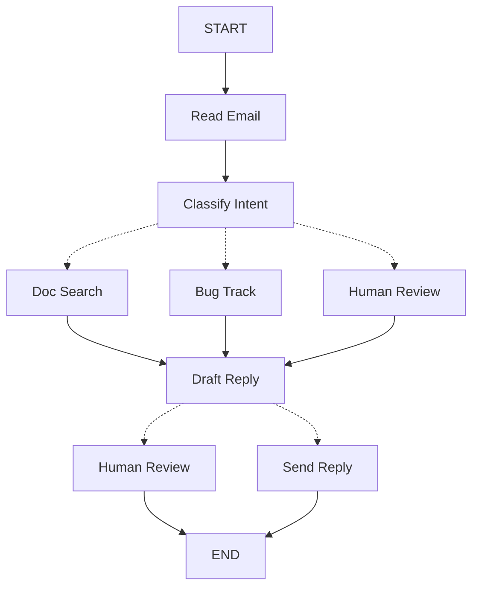

LangGraph는 에이전트를 구축하는 사고 방식을 바꿀 수 있습니다. LangGraph로 에이전트를 구축할 때는 먼저 **노드**라고 불리는 개별 단계로 분해합니다. 그런 다음 각 노드의 다양한 결정과 전환을 설명합니다. 마지막으로 각 노드가 읽고 쓸 수 있는 공유 **상태**를 통해 노드들을 연결합니다. 이 튜토리얼에서는 LangGraph로 고객 지원 이메일 에이전트를 구축하는 사고 과정을 안내합니다.

## 자동화하려는 프로세스부터 시작하기

고객 지원 이메일을 처리하는 AI 에이전트를 구축해야 한다고 가정해 보겠습니다. 제품 팀에서 다음과 같은 요구사항을 제시했습니다:

에이전트가 수행해야 할 작업:

- 수신된 고객 이메일 읽기
- 긴급도와 주제별로 분류
- 질문에 답변하기 위한 관련 문서 검색
- 적절한 응답 초안 작성
- 복잡한 문제를 담당자에게 에스컬레이션
- 필요시 후속 조치 일정 잡기

처리해야 할 예시 시나리오:

1. 간단한 제품 질문: "비밀번호를 재설정하려면 어떻게 하나요?"
2. 버그 보고: "PDF 형식을 선택하면 내보내기 기능이 충돌합니다"
3. 긴급 청구 문제: "구독료가 두 번 청구되었습니다!"
4. 기능 요청: "모바일 앱에 다크 모드를 추가할 수 있나요?"
5. 복잡한 기술적 문제: "API 통합이 504 오류로 간헐적으로 실패합니다"

LangGraph에서 에이전트를 구현하려면 일반적으로 동일한 5단계를 따릅니다.

## 1단계: 워크플로를 개별 단계로 매핑하기

프로세스의 개별 단계를 식별하는 것부터 시작합니다. 각 단계는 **노드**(특정 작업을 수행하는 함수)가 됩니다. 그런 다음 이러한 단계들이 서로 어떻게 연결되는지 스케치합니다.



화살표는 가능한 경로를 보여주지만, 어떤 경로를 선택할지에 대한 실제 결정은 각 노드 내부에서 이루어집니다.

이제 워크플로의 구성 요소를 식별했으므로 각 노드가 수행해야 할 작업을 이해해 보겠습니다:

- Read Email: 이메일 콘텐츠 추출 및 파싱
- Classify Intent: LLM을 사용하여 긴급도와 주제를 분류한 다음 적절한 작업으로 라우팅
- Doc Search: 관련 정보를 위해 지식 베이스 쿼리
- Bug Track: 추적 시스템에서 이슈 생성 또는 업데이트
- Draft Reply: 적절한 응답 생성
- Human Review: 승인 또는 처리를 위해 담당자에게 에스컬레이션
- Send Reply: 이메일 응답 발송

<Tip>
일부 노드는 다음에 어디로 갈지 결정하는 반면(Classify Intent, Draft Reply, Human Review), 다른 노드는 항상 동일한 다음 단계로 진행한다는 점에 유의하세요(Read Email은 항상 Classify Intent로, Doc Search는 항상 Draft Reply로 이동합니다).
</Tip>

## 2단계: 각 단계가 수행해야 할 작업 식별하기

그래프의 각 노드에 대해 어떤 유형의 작업을 나타내는지, 그리고 제대로 작동하려면 어떤 컨텍스트가 필요한지 결정합니다.

<CardGroup cols={2}>
  <Card title="LLM 단계" icon="brain" href="#llm-steps">
    텍스트를 이해, 분석, 생성하거나 추론 결정을 내려야 할 때 사용
  </Card>
  <Card title="데이터 단계" icon="database" href="#data-steps">
    외부 소스에서 정보를 검색해야 할 때 사용
  </Card>
  <Card title="액션 단계" icon="bolt" href="#action-steps">
    외부 작업을 수행해야 할 때 사용
  </Card>
  <Card title="사용자 입력 단계" icon="user" href="#user-input-steps">
    사람의 개입이 필요할 때 사용
  </Card>
</CardGroup>

### LLM 단계

단계에서 텍스트를 이해, 분석, 생성하거나 추론 결정을 내려야 하는 경우:

<AccordionGroup>
  <Accordion title="Classify Intent 노드">
    - 정적 컨텍스트 (프롬프트): 분류 카테고리, 긴급도 정의, 응답 형식
    - 동적 컨텍스트 (상태에서): 이메일 콘텐츠, 발신자 정보
    - 원하는 결과: 라우팅을 결정하는 구조화된 분류
  </Accordion>

  <Accordion title="Draft Reply 노드">
    - 정적 컨텍스트 (프롬프트): 톤 가이드라인, 회사 정책, 응답 템플릿
    - 동적 컨텍스트 (상태에서): 분류 결과, 검색 결과, 고객 이력
    - 원하는 결과: 검토 준비가 완료된 전문적인 이메일 응답
  </Accordion>
</AccordionGroup>

### 데이터 단계

단계에서 외부 소스로부터 정보를 검색해야 하는 경우:

<AccordionGroup>
  <Accordion title="Doc Search 노드">
    - 매개변수: 의도와 주제로부터 구축된 쿼리
    - 재시도 전략: 예, 일시적 실패에 대한 지수 백오프 사용
    - 캐싱: API 호출을 줄이기 위해 일반적인 쿼리 캐싱 가능
  </Accordion>

  <Accordion title="Customer History Lookup">
    - 매개변수: 상태의 고객 이메일 또는 ID
    - 재시도 전략: 예, 하지만 사용 불가능한 경우 기본 정보로 대체
    - 캐싱: 예, 최신성과 성능의 균형을 위해 TTL 사용
  </Accordion>
</AccordionGroup>

### 액션 단계

단계에서 외부 작업을 수행해야 하는 경우:

<AccordionGroup>
  <Accordion title="Send Reply 노드">
    - 실행 시점: 승인 후 (사람 또는 자동)
    - 재시도 전략: 예, 네트워크 문제에 대한 지수 백오프 사용
    - 캐싱하지 않음: 각 발송은 고유한 작업
  </Accordion>

  <Accordion title="Bug Track 노드">
    - 실행 시점: 의도가 "bug"일 때 항상
    - 재시도 전략: 예, 버그 보고서를 잃지 않는 것이 중요
    - 반환: 응답에 포함할 티켓 ID
  </Accordion>
</AccordionGroup>

### 사용자 입력 단계

단계에서 사람의 개입이 필요한 경우:

<AccordionGroup>
  <Accordion title="Human Review 노드">
    - 결정을 위한 컨텍스트: 원본 이메일, 응답 초안, 긴급도, 분류
    - 예상 입력 형식: 승인 불리언 및 선택적으로 편집된 응답
    - 트리거 시점: 높은 긴급도, 복잡한 문제 또는 품질 우려
  </Accordion>
</AccordionGroup>

## 3단계: 상태 설계하기

상태는 에이전트의 모든 노드가 접근할 수 있는 공유 [메모리](/oss/python/concepts/memory)입니다. 에이전트가 프로세스를 진행하면서 학습하고 결정하는 모든 것을 추적하는 데 사용하는 노트로 생각하면 됩니다.

### 무엇이 상태에 속하나요?

각 데이터 조각에 대해 다음 질문을 스스로에게 물어보세요:

<CardGroup cols={2}>
  <Card title="상태에 포함" icon="check">
    단계를 거쳐 지속되어야 하나요? 그렇다면 상태에 포함됩니다.
  </Card>

  <Card title="저장하지 않음" icon="code">
    다른 데이터로부터 파생할 수 있나요? 그렇다면 상태에 저장하는 대신 필요할 때 계산하세요.
  </Card>
</CardGroup>

이메일 에이전트의 경우 다음을 추적해야 합니다:

- 원본 이메일 및 발신자 정보 (재구성할 수 없음)
- 분류 결과 (여러 다운스트림 노드에서 필요)
- 검색 결과 및 고객 데이터 (재검색 비용이 큼)
- 응답 초안 (검토를 거쳐 지속되어야 함)
- 실행 메타데이터 (디버깅 및 복구용)

### 상태를 원시 상태로 유지하고 프롬프트는 필요시 포맷하기

<Tip>
핵심 원칙: 상태는 원시 데이터를 저장해야 하며 포맷된 텍스트가 아닙니다. 필요할 때 노드 내부에서 프롬프트를 포맷하세요.
</Tip>

이러한 분리는 다음을 의미합니다:

- 서로 다른 노드가 필요에 따라 동일한 데이터를 다르게 포맷할 수 있습니다
- 상태 스키마를 수정하지 않고 프롬프트 템플릿을 변경할 수 있습니다
- 디버깅이 더 명확합니다 - 각 노드가 받은 정확한 데이터를 볼 수 있습니다
- 에이전트가 기존 상태를 손상시키지 않고 진화할 수 있습니다

상태를 정의해 보겠습니다:

```python
from typing import TypedDict, Literal

# Define the structure for email classification
class EmailClassification(TypedDict):
    intent: Literal["question", "bug", "billing", "feature", "complex"]
    urgency: Literal["low", "medium", "high", "critical"]
    topic: str
    summary: str

class EmailAgentState(TypedDict):
    # Raw email data
    email_content: str
    sender_email: str
    email_id: str

    # Classification result
    classification: EmailClassification | None

    # Raw search/API results
    search_results: list[str] | None  # List of raw document chunks
    customer_history: dict | None  # Raw customer data from CRM

    # Generated content
    draft_response: str | None
```


상태는 원시 데이터만 포함하며 프롬프트 템플릿, 포맷된 문자열, 지시사항은 포함하지 않습니다. 분류 출력은 LLM에서 직접 가져온 단일 딕셔너리로 저장됩니다.

## 4단계: 노드 구축하기

이제 각 단계를 함수로 구현합니다. LangGraph의 노드는 현재 상태를 받아 업데이트를 반환하는 Python 함수일 뿐입니다.


### 오류를 적절하게 처리하기

서로 다른 오류는 서로 다른 처리 전략이 필요합니다:

| 오류 유형 | 해결 주체 | 전략 | 사용 시점 |
|------------|--------------|----------|-------------|
| 일시적 오류 (네트워크 문제, 속도 제한) | 시스템 (자동) | 재시도 정책 | 재시도 시 일반적으로 해결되는 일시적 장애 |
| LLM 복구 가능 오류 (도구 실패, 파싱 문제) | LLM | 상태에 오류를 저장하고 루프백 | LLM이 오류를 보고 접근 방식을 조정할 수 있음 |
| 사용자 수정 가능 오류 (정보 누락, 불명확한 지시사항) | 사람 | `interrupt()`로 일시 중지 | 진행하려면 사용자 입력이 필요 |
| 예상치 못한 오류 | 개발자 | 버블업하도록 허용 | 디버깅이 필요한 알 수 없는 문제 |

<Tabs>
  <Tab title="일시적 오류" icon="rotate">
    네트워크 문제와 속도 제한을 자동으로 재시도하도록 재시도 정책을 추가합니다:

```python
from langgraph.types import RetryPolicy

workflow.add_node(
    "search_documentation",
    search_documentation,
    retry_policy=RetryPolicy(max_attempts=3, initial_interval=1.0)
)
```


  </Tab>

  <Tab title="LLM 복구 가능" icon="brain">
    LLM이 무엇이 잘못되었는지 보고 다시 시도할 수 있도록 오류를 상태에 저장하고 루프백합니다:

```python
def execute_tool(state: State) -> Command[Literal["agent", "execute_tool"]]:
    try:
        result = run_tool(state['tool_call'])
        return Command(update={"tool_result": result}, goto="agent")
    except ToolError as e:
        # Let the LLM see what went wrong and try again
        return Command(
            update={"tool_result": f"Tool error: {str(e)}"},
            goto="agent"
        )
```


  </Tab>

  <Tab title="사용자 수정 가능" icon="user">
    필요할 때 사용자로부터 정보를 수집하기 위해 일시 중지합니다(계정 ID, 주문 번호 또는 명확화):

```python
def lookup_customer_history(state: State) -> Command[Literal["draft_response"]]:
    if not state.get('customer_id'):
        user_input = interrupt({
            "message": "Customer ID needed",
            "request": "Please provide the customer's account ID to look up their subscription history"
        })
        return Command(
            update={"customer_id": user_input['customer_id']},
            goto="lookup_customer_history"
        )
    # Now proceed with the lookup
    customer_data = fetch_customer_history(state['customer_id'])
    return Command(update={"customer_history": customer_data}, goto="draft_response")
```


  </Tab>

  <Tab title="예상치 못한" icon="triangle-exclamation">
    디버깅을 위해 버블업하도록 허용합니다. 처리할 수 없는 것은 캐치하지 마세요:

```python
def send_reply(state: EmailAgentState):
    try:
        email_service.send(state["draft_response"])
    except Exception:
        raise  # Surface unexpected errors
```


  </Tab>
</Tabs>


### 이메일 에이전트 노드 구현하기

각 노드를 간단한 함수로 구현하겠습니다. 기억하세요: 노드는 상태를 받아 작업을 수행하고 업데이트를 반환합니다.

<AccordionGroup>
  <Accordion title="읽기 및 분류 노드" icon="brain">

```python
from typing import Literal
from langgraph.graph import StateGraph, START, END
from langgraph.types import interrupt, Command, RetryPolicy
from langchain_openai import ChatOpenAI
from langchain_core.messages import HumanMessage

llm = ChatOpenAI(model="gpt-4")

def read_email(state: EmailAgentState) -> dict:
    """Extract and parse email content"""
    # In production, this would connect to your email service
    return {
        "messages": [HumanMessage(content=f"Processing email: {state['email_content']}")]
    }

def classify_intent(state: EmailAgentState) -> Command[Literal["search_documentation", "human_review", "draft_response", "bug_tracking"]]:
    """Use LLM to classify email intent and urgency, then route accordingly"""

    # Create structured LLM that returns EmailClassification dict
    structured_llm = llm.with_structured_output(EmailClassification)

    # Format the prompt on-demand, not stored in state
    classification_prompt = f"""
    Analyze this customer email and classify it:

    Email: {state['email_content']}
    From: {state['sender_email']}

    Provide classification including intent, urgency, topic, and summary.
    """

    # Get structured response directly as dict
    classification = structured_llm.invoke(classification_prompt)

    # Determine next node based on classification
    if classification['intent'] == 'billing' or classification['urgency'] == 'critical':
        goto = "human_review"
    elif classification['intent'] in ['question', 'feature']:
        goto = "search_documentation"
    elif classification['intent'] == 'bug':
        goto = "bug_tracking"
    else:
        goto = "draft_response"

    # Store classification as a single dict in state
    return Command(
        update={"classification": classification},
        goto=goto
    )
```


  </Accordion>

  <Accordion title="검색 및 추적 노드" icon="database">

```python
def search_documentation(state: EmailAgentState) -> Command[Literal["draft_response"]]:
    """Search knowledge base for relevant information"""

    # Build search query from classification
    classification = state.get('classification', {})
    query = f"{classification.get('intent', '')} {classification.get('topic', '')}"

    try:
        # Implement your search logic here
        # Store raw search results, not formatted text
        search_results = [
            "Reset password via Settings > Security > Change Password",
            "Password must be at least 12 characters",
            "Include uppercase, lowercase, numbers, and symbols"
        ]
    except SearchAPIError as e:
        # For recoverable search errors, store error and continue
        search_results = [f"Search temporarily unavailable: {str(e)}"]

    return Command(
        update={"search_results": search_results},  # Store raw results or error
        goto="draft_response"
    )

def bug_tracking(state: EmailAgentState) -> Command[Literal["draft_response"]]:
    """Create or update bug tracking ticket"""

    # Create ticket in your bug tracking system
    ticket_id = "BUG-12345"  # Would be created via API

    return Command(
        update={
            "search_results": [f"Bug ticket {ticket_id} created"],
            "current_step": "bug_tracked"
        },
        goto="draft_response"
    )
```


  </Accordion>

  <Accordion title="응답 노드" icon="pen-to-square">

```python
def draft_response(state: EmailAgentState) -> Command[Literal["human_review", "send_reply"]]:
    """Generate response using context and route based on quality"""

    classification = state.get('classification', {})

    # Format context from raw state data on-demand
    context_sections = []

    if state.get('search_results'):
        # Format search results for the prompt
        formatted_docs = "\n".join([f"- {doc}" for doc in state['search_results']])
        context_sections.append(f"Relevant documentation:\n{formatted_docs}")

    if state.get('customer_history'):
        # Format customer data for the prompt
        context_sections.append(f"Customer tier: {state['customer_history'].get('tier', 'standard')}")

    # Build the prompt with formatted context
    draft_prompt = f"""
    Draft a response to this customer email:
    {state['email_content']}

    Email intent: {classification.get('intent', 'unknown')}
    Urgency level: {classification.get('urgency', 'medium')}

    {chr(10).join(context_sections)}

    Guidelines:
    - Be professional and helpful
    - Address their specific concern
    - Use the provided documentation when relevant
    """

    response = llm.invoke(draft_prompt)

    # Determine if human review needed based on urgency and intent
    needs_review = (
        classification.get('urgency') in ['high', 'critical'] or
        classification.get('intent') == 'complex'
    )

    # Route to appropriate next node
    goto = "human_review" if needs_review else "send_reply"

    return Command(
        update={"draft_response": response.content},  # Store only the raw response
        goto=goto
    )

def human_review(state: EmailAgentState) -> Command[Literal["send_reply", END]]:
    """Pause for human review using interrupt and route based on decision"""

    classification = state.get('classification', {})

    # interrupt() must come first - any code before it will re-run on resume
    human_decision = interrupt({
        "email_id": state['email_id'],
        "original_email": state['email_content'],
        "draft_response": state['draft_response'],
        "urgency": classification.get('urgency'),
        "intent": classification.get('intent'),
        "action": "Please review and approve/edit this response"
    })

    # Now process the human's decision
    if human_decision.get("approved"):
        return Command(
            update={"draft_response": human_decision.get("edited_response", state['draft_response'])},
            goto="send_reply"
        )
    else:
        # Rejection means human will handle directly
        return Command(update={}, goto=END)

def send_reply(state: EmailAgentState) -> dict:
    """Send the email response"""
    # Integrate with email service
    print(f"Sending reply: {state['draft_response'][:100]}...")
    return {}
```


  </Accordion>
</AccordionGroup>

## 5단계: 함께 연결하기

이제 노드들을 작동하는 그래프로 연결합니다. 노드가 자체 라우팅 결정을 처리하므로 몇 가지 필수 엣지만 필요합니다.

`interrupt()`를 사용한 [human-in-the-loop](/oss/python/langgraph/add-human-in-the-loop)를 활성화하려면 실행 간 상태를 저장하기 위한 [체크포인터](/oss/python/langgraph/persistence)와 함께 컴파일해야 합니다:

<Accordion title="그래프 컴파일 코드" icon="diagram-project" defaultOpen={true}>

```python
from langgraph.checkpoint.memory import MemorySaver
from langgraph.types import RetryPolicy

# Create the graph
workflow = StateGraph(EmailAgentState)

# Add nodes with appropriate error handling
workflow.add_node("read_email", read_email)
workflow.add_node("classify_intent", classify_intent)

# Add retry policy for nodes that might have transient failures
workflow.add_node(
    "search_documentation",
    search_documentation,
    retry_policy=RetryPolicy(max_attempts=3)
)
workflow.add_node("bug_tracking", bug_tracking)
workflow.add_node("draft_response", draft_response)
workflow.add_node("human_review", human_review)
workflow.add_node("send_reply", send_reply)

# Add only the essential edges
workflow.add_edge(START, "read_email")
workflow.add_edge("read_email", "classify_intent")
workflow.add_edge("send_reply", END)

# Compile with checkpointer for persistence
memory = MemorySaver()
app = workflow.compile(checkpointer=memory)
```


</Accordion>

그래프 구조는 노드 내부에서 `Command` 객체를 통해 라우팅이 발생하기 때문에 최소화됩니다. 각 노드는 `Command[Literal["node1", "node2"]]`와 같은 타입 힌트를 사용하여 갈 수 있는 곳을 선언하므로 흐름이 명시적이고 추적 가능합니다.


### 에이전트 시험해보기

담당자의 검토가 필요한 긴급 청구 문제로 에이전트를 실행해 보겠습니다:

<Accordion title="에이전트 테스트" icon="flask">

```python
# Test with an urgent billing issue
initial_state = {
    "email_content": "I was charged twice for my subscription! This is urgent!",
    "sender_email": "customer@example.com",
    "email_id": "email_123",
    "messages": []
}

# Run with a thread_id for persistence
config = {"configurable": {"thread_id": "customer_123"}}
result = app.invoke(initial_state, config)
# The graph will pause at human_review
print(f"Draft ready for review: {result['draft_response'][:100]}...")

# When ready, provide human input to resume
from langgraph.types import Command

human_response = Command(
    resume={
        "approved": True,
        "edited_response": "We sincerely apologize for the double charge. I've initiated an immediate refund..."
    }
)

# Resume execution
final_result = app.invoke(human_response, config)
print(f"Email sent successfully!")
```


</Accordion>

그래프는 `interrupt()`에 도달하면 일시 중지되고, 모든 것을 체크포인터에 저장한 후 대기합니다. 며칠 후에도 재개될 수 있으며 중단한 지점부터 정확히 이어갑니다. thread_id는 이 대화의 모든 상태가 함께 보존되도록 보장합니다.

## 요약 및 다음 단계

### 핵심 인사이트

이메일 에이전트를 구축하면서 LangGraph 방식의 사고를 배웠습니다:

<CardGroup cols={2}>
  <Card title="개별 단계로 분해" icon="sitemap" href="#step-1-map-out-your-workflow-as-discrete-steps">
    각 노드는 한 가지 작업을 잘 수행합니다. 이러한 분해는 스트리밍 진행 업데이트, 일시 중지하고 재개할 수 있는 지속 가능한 실행, 그리고 단계 간 상태를 검사할 수 있어 명확한 디버깅을 가능하게 합니다.
  </Card>

  <Card title="상태는 공유 메모리" icon="database" href="#step-3-design-your-state">
    포맷된 텍스트가 아닌 원시 데이터를 저장하세요. 이를 통해 서로 다른 노드가 동일한 정보를 다양한 방식으로 사용할 수 있습니다.
  </Card>

  <Card title="노드는 함수" icon="code" href="#step-4-build-your-nodes">
    상태를 받아 작업을 수행하고 업데이트를 반환합니다. 라우팅 결정을 내려야 할 때는 상태 업데이트와 다음 목적지를 모두 지정합니다.
  </Card>

  <Card title="오류는 흐름의 일부" icon="triangle-exclamation" href="#handle-errors-appropriately">
    일시적 장애는 재시도되고, LLM 복구 가능 오류는 컨텍스트와 함께 루프백되며, 사용자 수정 가능 문제는 입력을 위해 일시 중지되고, 예상치 못한 오류는 디버깅을 위해 버블업됩니다.
  </Card>

  <Card title="사용자 입력은 일급 시민" icon="user" href="/oss/python/langgraph/add-human-in-the-loop">
    `interrupt()` 함수는 실행을 무기한 일시 중지하고, 모든 상태를 저장하며, 입력을 제공하면 중단한 지점부터 정확히 재개합니다. 노드의 다른 작업과 결합될 때는 먼저 와야 합니다.
  </Card>

  <Card title="그래프 구조는 자연스럽게 나타남" icon="diagram-project" href="#step-5-wire-it-together">
    필수 연결을 정의하면 노드가 자체 라우팅 로직을 처리합니다. 이를 통해 제어 흐름이 명시적이고 추적 가능하게 유지됩니다 - 현재 노드를 보면 에이전트가 다음에 무엇을 할지 항상 이해할 수 있습니다.
  </Card>
</CardGroup>

### 고급 고려사항

<Accordion title="노드 세분성 트레이드오프" icon="sliders">
<Info>
이 섹션에서는 노드 세분성 설계의 트레이드오프를 탐구합니다. 대부분의 애플리케이션은 이를 건너뛰고 위에 표시된 패턴을 사용할 수 있습니다.
</Info>

왜 Read Email과 Classify Intent를 하나의 노드로 결합하지 않을까요? 또는 왜 Doc Search를 Draft Reply에서 분리할까요? 답은 복원력과 관찰 가능성 간의 트레이드오프와 관련이 있습니다.

복원력 고려사항: LangGraph의 [지속 가능한 실행](/oss/python/langgraph/durable-execution)은 노드 경계에서 체크포인트를 생성합니다. 중단이나 실패 후 워크플로가 재개될 때 실행이 중단된 노드의 시작부터 시작됩니다. 작은 노드는 더 빈번한 체크포인트를 의미하며, 문제가 발생했을 때 반복해야 할 작업이 줄어듭니다. 여러 작업을 하나의 큰 노드로 결합하면 끝 부분에서 실패가 발생할 경우 해당 노드의 시작부터 모든 것을 다시 실행해야 합니다.

이메일 에이전트에 대해 이러한 분해를 선택한 이유:

- 외부 서비스의 격리: Doc Search와 Bug Track은 외부 API를 호출하기 때문에 별도의 노드입니다. 검색 서비스가 느리거나 실패하면 LLM 호출로부터 격리하고자 합니다. 다른 노드에 영향을 주지 않고 이러한 특정 노드에 재시도 정책을 추가할 수 있습니다.

- 중간 가시성: Classify Intent를 자체 노드로 갖는 것은 조치를 취하기 전에 LLM이 결정한 내용을 검사할 수 있게 합니다. 이는 디버깅과 모니터링에 유용합니다 - 에이전트가 언제 그리고 왜 담당자 검토로 라우팅되는지 정확히 볼 수 있습니다.

- 다른 실패 모드: LLM 호출, 데이터베이스 조회, 이메일 발송은 서로 다른 재시도 전략을 갖습니다. 별도의 노드를 사용하면 이를 독립적으로 구성할 수 있습니다.

- 재사용성과 테스팅: 작은 노드는 독립적으로 테스트하고 다른 워크플로에서 재사용하기가 더 쉽습니다.

다른 유효한 접근 방식: Read Email과 Classify Intent를 단일 노드로 결합할 수 있습니다. 분류 전에 원시 이메일을 검사하는 기능을 잃게 되고 해당 노드의 실패 시 두 작업을 모두 반복해야 합니다. 대부분의 애플리케이션의 경우 별도 노드의 관찰 가능성과 디버깅 이점이 트레이드오프 가치가 있습니다.

애플리케이션 수준 고려사항: 2단계의 캐싱 논의(검색 결과를 캐싱할지 여부)는 애플리케이션 수준 결정이지 LangGraph 프레임워크 기능이 아닙니다. 특정 요구사항에 따라 노드 함수 내에서 캐싱을 구현합니다 - LangGraph는 이를 규정하지 않습니다.

체크포인트 동작 제어: [지속성 모드](/oss/python/langgraph/durable-execution#durability-modes)를 사용하여 체크포인트가 작성되는 시점을 조정할 수 있습니다. 기본 `"async"` 모드는 지속성을 유지하면서 좋은 성능을 위해 백그라운드에서 체크포인트를 작성합니다. 완료 시에만 체크포인트하려면 `"exit"` 모드를 사용하고(중간 실행 복구가 필요하지 않은 장기 실행 그래프의 경우 더 빠름), 다음 단계로 진행하기 전에 체크포인트가 작성되도록 보장하려면 `"sync"` 모드를 사용합니다(실행을 계속하기 전에 상태가 지속되도록 보장해야 할 때 유용).
</Accordion>

### 다음 단계

이것은 LangGraph로 에이전트를 구축하는 사고에 대한 소개였습니다. 이 기반을 다음과 같이 확장할 수 있습니다:

<CardGroup cols={2}>
  <Card title="Human-in-the-loop 패턴" icon="user-check" href="/oss/python/langgraph/add-human-in-the-loop">
    실행 전 도구 승인, 일괄 승인 및 기타 패턴을 추가하는 방법을 학습합니다
  </Card>

  <Card title="서브그래프" icon="diagram-nested" href="/oss/python/langgraph/use-subgraphs">
    복잡한 다단계 작업을 위한 서브그래프를 생성합니다
  </Card>

  <Card title="스트리밍" icon="tower-broadcast" href="/oss/python/langgraph/streaming">
    사용자에게 실시간 진행 상황을 표시하기 위해 스트리밍을 추가합니다
  </Card>

  <Card title="관찰 가능성" icon="chart-line" href="/oss/python/langgraph/observability">
    디버깅과 모니터링을 위해 LangSmith로 관찰 가능성을 추가합니다
  </Card>

  <Card title="도구 통합" icon="wrench" href="/oss/python/langchain/tools">
    웹 검색, 데이터베이스 쿼리, API 호출을 위한 더 많은 도구를 통합합니다
  </Card>

  <Card title="재시도 로직" icon="rotate" href="/oss/python/langgraph/use-graph-api#add-retry-policies">
    실패한 작업을 위해 지수 백오프를 사용한 재시도 로직을 구현합니다
  </Card>
</CardGroup>

---

<Callout icon="pen-to-square" iconType="regular">
  [Edit the source of this page on GitHub](https://github.com/langchain-ai/docs/edit/main/src/oss/langgraph/thinking-in-langgraph.mdx)
</Callout>
