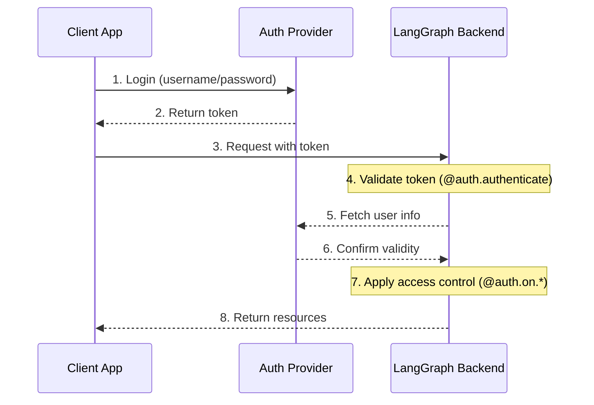
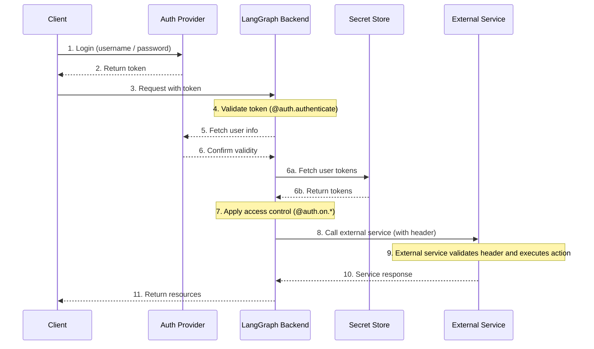

LangSmith는 대부분의 인증 체계와 통합할 수 있는 유연한 인증 및 권한 부여 시스템을 제공합니다.

## 핵심 개념

### 인증 vs 권한 부여

이 용어들은 종종 혼용되지만, 서로 다른 보안 개념을 나타냅니다:

* [**인증**](#authentication) ("AuthN")은 _사용자가 누구인지_ 확인합니다. 이는 모든 요청에 대해 미들웨어로 실행됩니다.
* [**권한 부여**](#authorization) ("AuthZ")는 _무엇을 할 수 있는지_ 결정합니다. 이는 리소스별로 사용자의 권한과 역할을 검증합니다.

LangSmith에서 인증은 [`@auth.authenticate`](/langsmith/smith-python-sdk#langgraph_sdk.auth.Auth.authenticate) 핸들러가 처리하고, 권한 부여는 [`@auth.on`](/langsmith/langgraph-python-sdk#langgraph_sdk.auth.Auth.on) 핸들러가 처리합니다.

## 기본 보안 모델

LangSmith는 다음과 같은 보안 기본값을 제공합니다:

### LangSmith

* 기본적으로 LangSmith API 키를 사용합니다
* `x-api-key` 헤더에 유효한 API 키가 필요합니다
* 사용자 정의 인증 핸들러로 커스터마이징할 수 있습니다

<Note>
**사용자 정의 인증**
사용자 정의 인증은 LangSmith의 모든 플랜에서 **지원됩니다**.
</Note>

### 자체 호스팅

* 기본 인증이 없습니다
* 보안 모델을 구현하는 데 완전한 유연성이 있습니다
* 인증 및 권한 부여의 모든 측면을 제어합니다


## 시스템 아키텍처

일반적인 인증 설정은 세 가지 주요 구성 요소로 이루어집니다:

1. **인증 제공자** (Identity Provider/IdP)
  * 사용자 ID 및 자격 증명을 관리하는 전용 서비스
  * 사용자 등록, 로그인, 비밀번호 재설정 등을 처리합니다
  * 인증 성공 후 토큰(JWT, 세션 토큰 등)을 발급합니다
  * 예시: Auth0, Supabase Auth, Okta 또는 자체 인증 서버
2. **LangGraph 백엔드** (Resource Server)
  * 비즈니스 로직 및 보호된 리소스를 포함하는 LangGraph 애플리케이션
  * 인증 제공자와 토큰을 검증합니다
  * 사용자 ID 및 권한에 기반하여 접근 제어를 적용합니다
  * 사용자 자격 증명을 직접 저장하지 않습니다
3. **클라이언트 애플리케이션** (Frontend)
  * 웹 앱, 모바일 앱 또는 API 클라이언트
  * 시간 제한이 있는 사용자 자격 증명을 수집하여 인증 제공자에 전송합니다
  * 인증 제공자로부터 토큰을 받습니다
  * LangGraph 백엔드에 요청할 때 이 토큰을 포함합니다

다음은 이러한 구성 요소가 일반적으로 상호 작용하는 방식입니다:



LangGraph의 [`@auth.authenticate`](/langsmith/langgraph-python-sdk#langgraph_sdk.auth.Auth.authenticate) 핸들러는 4-6단계를 처리하고, [`@auth.on`](/langsmith/langgraph-python-sdk#langgraph_sdk.auth.Auth.on) 핸들러는 7단계를 구현합니다.

## 인증

LangGraph의 인증은 모든 요청에 대해 미들웨어로 실행됩니다. [`@auth.authenticate`](/langsmith/langgraph-python-sdk#langgraph_sdk.auth.Auth.authenticate) 핸들러는 요청 정보를 받아 다음을 수행해야 합니다:

1. 자격 증명을 검증합니다
2. 유효한 경우 사용자의 ID 및 정보가 포함된 [사용자 정보](https://langchain-ai.github.io/langgraph/cloud/reference/sdk/python_sdk_ref/#langgraph_sdk.auth.types.MinimalUserDict)를 반환합니다
3. 유효하지 않은 경우 [HTTP 예외](https://langchain-ai.github.io/langgraph/cloud/reference/sdk/python_sdk_ref/#langgraph_sdk.auth.exceptions.HTTPException) 또는 AssertionError를 발생시킵니다

```python
from langgraph_sdk import Auth

auth = Auth()

@auth.authenticate
async def authenticate(headers: dict) -> Auth.types.MinimalUserDict:
    # Validate credentials (e.g., API key, JWT token)
    api_key = headers.get(b"x-api-key")
    if not api_key or not is_valid_key(api_key):
        raise Auth.exceptions.HTTPException(
            status_code=401,
            detail="Invalid API key"
        )

    # Return user info - only identity and is_authenticated are required
    # Add any additional fields you need for authorization
    return {
        "identity": "user-123",        # Required: unique user identifier
        "is_authenticated": True,      # Optional: assumed True by default
        "permissions": ["read", "write"] # Optional: for permission-based auth
        # You can add more custom fields if you want to implement other auth patterns
        "role": "admin",
        "org_id": "org-456"

    }
```

반환된 사용자 정보는 다음 위치에서 사용할 수 있습니다:

* 권한 부여 핸들러에서 [`ctx.user`](https://langchain-ai.github.io/langgraph/cloud/reference/sdk/python_sdk_ref/#langgraph_sdk.auth.types.AuthContext)를 통해 접근
* 애플리케이션에서 `config["configuration"]["langgraph_auth_user"]`를 통해 접근

<Accordion title="지원되는 매개변수">
  [`@auth.authenticate`](https://langchain-ai.github.io/langgraph/cloud/reference/sdk/python_sdk_ref/#langgraph_sdk.auth.Auth.authenticate) 핸들러는 이름으로 다음 매개변수 중 하나를 받을 수 있습니다:

  * request (Request): 원시 ASGI 요청 객체
  * path (str): 요청 경로, 예: `"/threads/abcd-1234-abcd-1234/runs/abcd-1234-abcd-1234/stream"`
  * method (str): HTTP 메서드, 예: `"GET"`
  * path_params (dict[str, str]): URL 경로 매개변수, 예: `{"thread_id": "abcd-1234-abcd-1234", "run_id": "abcd-1234-abcd-1234"}`
  * query_params (dict[str, str]): URL 쿼리 매개변수, 예: `{"stream": "true"}`
  * headers (dict[bytes, bytes]): 요청 헤더
  * authorization (str | None): Authorization 헤더 값 (예: `"Bearer <token>"`)

  많은 튜토리얼에서는 간결성을 위해 "authorization" 매개변수만 표시하지만, 사용자 정의 인증 체계를 구현하는 데 필요한 경우 더 많은 정보를 받도록 선택할 수 있습니다.
</Accordion>

### 에이전트 인증

사용자 정의 인증은 위임된 접근을 허용합니다. `@auth.authenticate`에서 반환하는 값은 실행 컨텍스트에 추가되므로, 에이전트에 사용자 범위 자격 증명을 제공하면 사용자를 대신하여 리소스에 접근할 수 있습니다.



인증 후 플랫폼은 구성 가능한 컨텍스트를 통해 그래프 및 모든 노드에 전달되는 특수 구성 객체를 생성합니다.
이 객체에는 [`@auth.authenticate`](https://langchain-ai.github.io/langgraph/cloud/reference/sdk/python_sdk_ref/#langgraph_sdk.auth.Auth.authenticate) 핸들러에서 반환한 사용자 정의 필드를 포함하여 현재 사용자에 대한 정보가 포함됩니다.

에이전트가 사용자를 대신하여 작업할 수 있도록 하려면 [사용자 정의 인증 미들웨어](/langsmith/custom-auth)를 사용하세요. 이를 통해 에이전트는 사용자를 대신하여 MCP 서버, 외부 데이터베이스, 심지어 다른 에이전트와 같은 외부 시스템과 상호 작용할 수 있습니다.

자세한 내용은 [사용자 정의 인증 사용](/langsmith/custom-auth#enable-agent-authentication) 가이드를 참조하세요.

### MCP를 사용한 에이전트 인증

MCP 서버에 에이전트를 인증하는 방법에 대한 정보는 [MCP 개념 가이드](/oss/langchain/mcp)를 참조하세요.

## 권한 부여

인증 후 LangGraph는 [`@auth.on`](https://langchain-ai.github.io/langgraph/cloud/reference/sdk/python_sdk_ref/#langgraph_sdk.auth.Auth.on) 핸들러를 호출하여 특정 리소스(예: 스레드, 어시스턴트, 크론)에 대한 접근을 제어합니다. 이러한 핸들러는 다음을 수행할 수 있습니다:

1. `value["metadata"]` 딕셔너리를 직접 변경하여 리소스 생성 시 저장될 메타데이터를 추가합니다. 각 작업에 대해 값이 가질 수 있는 유형 목록은 [지원되는 작업 표](#supported-actions)를 참조하세요.
2. [필터 딕셔너리](#filter-operations)를 반환하여 검색/목록 또는 읽기 작업 중 메타데이터로 리소스를 필터링합니다.
3. 접근이 거부된 경우 HTTP 예외를 발생시킵니다.

단순히 사용자 범위 접근 제어를 구현하려면 모든 리소스 및 작업에 대해 단일 [`@auth.on`](https://langchain-ai.github.io/langgraph/cloud/reference/sdk/python_sdk_ref/#langgraph_sdk.auth.Auth.on) 핸들러를 사용할 수 있습니다. 리소스 및 작업에 따라 다른 제어를 원하면 [리소스별 핸들러](#resource-specific-handlers)를 사용할 수 있습니다. 접근 제어를 지원하는 리소스의 전체 목록은 [지원되는 리소스](#supported-resources) 섹션을 참조하세요.

```python
@auth.on
async def add_owner(
    ctx: Auth.types.AuthContext,
    value: dict  # The payload being sent to this access method
) -> dict:  # Returns a filter dict that restricts access to resources
    """Authorize all access to threads, runs, crons, and assistants.

    This handler does two things:
        - Adds a value to resource metadata (to persist with the resource so it can be filtered later)
        - Returns a filter (to restrict access to existing resources)

    Args:
        ctx: Authentication context containing user info, permissions, the path, and
        value: The request payload sent to the endpoint. For creation
              operations, this contains the resource parameters. For read
              operations, this contains the resource being accessed.

    Returns:
        A filter dictionary that LangGraph uses to restrict access to resources.
        See [Filter Operations](#filter-operations) for supported operators.
    """
    # Create filter to restrict access to just this user's resources
    filters = {"owner": ctx.user.identity}

    # Get or create the metadata dictionary in the payload
    # This is where we store persistent info about the resource
    metadata = value.setdefault("metadata", {})

    # Add owner to metadata - if this is a create or update operation,
    # this information will be saved with the resource
    # So we can filter by it later in read operations
    metadata.update(filters)

    # Return filters to restrict access
    # These filters are applied to ALL operations (create, read, update, search, etc.)
    # to ensure users can only access their own resources
    return filters
```

<a id="resource-specific-handlers"></a>
### 리소스별 핸들러

[`@auth.on`](https://langchain-ai.github.io/langgraph/cloud/reference/sdk/python_sdk_ref/#langgraph_sdk.auth.Auth.on) 데코레이터로 리소스와 작업 이름을 연결하여 특정 리소스 및 작업에 대한 핸들러를 등록할 수 있습니다.
요청이 이루어지면 해당 리소스 및 작업과 일치하는 가장 구체적인 핸들러가 호출됩니다. 다음은 특정 리소스 및 작업에 대한 핸들러를 등록하는 방법의 예입니다. 다음 설정의 경우:

1. 인증된 사용자는 스레드를 생성하고, 스레드를 읽고, 스레드에서 실행을 생성할 수 있습니다
2. "assistants:create" 권한이 있는 사용자만 새 어시스턴트를 생성할 수 있습니다
3. 다른 모든 엔드포인트(예: 어시스턴트 삭제, 크론, 저장소)는 모든 사용자에 대해 비활성화됩니다.

<Tip>
**지원되는 핸들러**
지원되는 리소스 및 작업의 전체 목록은 아래의 [지원되는 리소스](#supported-resources) 섹션을 참조하세요.
</Tip>

```python
# Generic / global handler catches calls that aren't handled by more specific handlers
@auth.on
async def reject_unhandled_requests(ctx: Auth.types.AuthContext, value: Any) -> False:
    print(f"Request to {ctx.path} by {ctx.user.identity}")
    raise Auth.exceptions.HTTPException(
        status_code=403,
        detail="Forbidden"
    )

# Matches the "thread" resource and all actions - create, read, update, delete, search
# Since this is **more specific** than the generic @auth.on handler, it will take precedence
# over the generic handler for all actions on the "threads" resource
@auth.on.threads
async def on_thread(
    ctx: Auth.types.AuthContext,
    value: Auth.types.threads.create.value
):
    # Setting metadata on the thread being created
    # will ensure that the resource contains an "owner" field
    # Then any time a user tries to access this thread or runs within the thread,
    # we can filter by owner
    metadata = value.setdefault("metadata", {})
    metadata["owner"] = ctx.user.identity
    return {"owner": ctx.user.identity}


# Thread creation. This will match only on thread create actions
# Since this is **more specific** than both the generic @auth.on handler and the @auth.on.threads handler,
# it will take precedence for any "create" actions on the "threads" resources
@auth.on.threads.create
async def on_thread_create(
    ctx: Auth.types.AuthContext,
    value: Auth.types.threads.create.value
):
    # Reject if the user does not have write access
    if "write" not in ctx.permissions:
        raise Auth.exceptions.HTTPException(
            status_code=403,
            detail="User lacks the required permissions."
        )
    # Setting metadata on the thread being created
    # will ensure that the resource contains an "owner" field
    # Then any time a user tries to access this thread or runs within the thread,
    # we can filter by owner
    metadata = value.setdefault("metadata", {})
    metadata["owner"] = ctx.user.identity
    return {"owner": ctx.user.identity}

# Reading a thread. Since this is also more specific than the generic @auth.on handler, and the @auth.on.threads handler,
# it will take precedence for any "read" actions on the "threads" resource
@auth.on.threads.read
async def on_thread_read(
    ctx: Auth.types.AuthContext,
    value: Auth.types.threads.read.value
):
    # Since we are reading (and not creating) a thread,
    # we don't need to set metadata. We just need to
    # return a filter to ensure users can only see their own threads
    return {"owner": ctx.user.identity}

# Run creation, streaming, updates, etc.
# This takes precedenceover the generic @auth.on handler and the @auth.on.threads handler
@auth.on.threads.create_run
async def on_run_create(
    ctx: Auth.types.AuthContext,
    value: Auth.types.threads.create_run.value
):
    metadata = value.setdefault("metadata", {})
    metadata["owner"] = ctx.user.identity
    # Inherit thread's access control
    return {"owner": ctx.user.identity}

# Assistant creation
@auth.on.assistants.create
async def on_assistant_create(
    ctx: Auth.types.AuthContext,
    value: Auth.types.assistants.create.value
):
    if "assistants:create" not in ctx.permissions:
        raise Auth.exceptions.HTTPException(
            status_code=403,
            detail="User lacks the required permissions."
        )
```

위의 예에서 전역 핸들러와 리소스별 핸들러를 혼합하고 있습니다. 각 요청은 가장 구체적인 핸들러에 의해 처리되므로 `thread`를 생성하는 요청은 `on_thread_create` 핸들러와 일치하지만 `reject_unhandled_requests` 핸들러와는 일치하지 않습니다. 그러나 스레드를 `업데이트`하는 요청은 해당 리소스 및 작업에 대한 더 구체적인 핸들러가 없으므로 전역 핸들러에 의해 처리됩니다.

<a id="filter-operations"></a>
### 필터 작업

권한 부여 핸들러는 `None`, 불린 값 또는 필터 딕셔너리를 반환할 수 있습니다.

* `None` 및 `True`는 "모든 하위 리소스에 대한 접근 권한 부여"를 의미합니다
* `False`는 "모든 하위 리소스에 대한 접근 거부(403 예외 발생)"를 의미합니다
* 메타데이터 필터 딕셔너리는 리소스에 대한 접근을 제한합니다

필터 딕셔너리는 리소스 메타데이터와 일치하는 키를 가진 딕셔너리입니다. 세 가지 연산자를 지원합니다:

* 기본값은 정확히 일치하는 "$eq"의 약칭입니다. 예를 들어 `{"owner": user_id}`는 메타데이터에 `{"owner": user_id}`가 포함된 리소스만 포함합니다
* `$eq`: 정확히 일치 (예: `{"owner": {"$eq": user_id}}`) - 이는 위의 약칭인 `{"owner": user_id}`와 동일합니다
* `$contains`: 리스트 멤버십 (예: `{"allowed_users": {"$contains": user_id}}`) 또는 리스트 포함 (예: `{"allowed_users": {"$contains": [user_id_1, user_id_2]}}`). 여기서 값은 각각 리스트의 요소이거나 리스트 요소의 하위 집합이어야 합니다. 저장된 리소스의 메타데이터는 리스트/컨테이너 유형이어야 합니다.

여러 키가 있는 딕셔너리는 논리적 `AND` 필터를 사용하여 처리됩니다. 예를 들어 `{"owner": org_id, "allowed_users": {"$contains": user_id}}`는 메타데이터의 "owner"가 `org_id`이고 "allowed_users" 리스트에 `user_id`가 포함된 리소스만 일치시킵니다.
자세한 내용은 [여기](https://langchain-ai.github.io/langgraph/cloud/reference/sdk/python_sdk_ref/#langgraph_sdk.auth.types.FilterType) 참조를 확인하세요.

## 일반적인 접근 패턴

다음은 몇 가지 일반적인 권한 부여 패턴입니다:

### 단일 소유자 리소스

이 일반적인 패턴을 사용하면 모든 스레드, 어시스턴트, 크론 및 실행을 단일 사용자로 범위를 지정할 수 있습니다. 일반적인 챗봇 스타일 앱과 같은 일반적인 단일 사용자 사용 사례에 유용합니다.

```python
@auth.on
async def owner_only(ctx: Auth.types.AuthContext, value: dict):
    metadata = value.setdefault("metadata", {})
    metadata["owner"] = ctx.user.identity
    return {"owner": ctx.user.identity}
```

### 권한 기반 접근

이 패턴을 사용하면 **권한**을 기반으로 접근을 제어할 수 있습니다. 특정 역할이 리소스에 대해 더 광범위하거나 더 제한된 접근 권한을 갖도록 하려는 경우 유용합니다.

```python
# In your auth handler:
@auth.authenticate
async def authenticate(headers: dict) -> Auth.types.MinimalUserDict:
    ...
    return {
        "identity": "user-123",
        "is_authenticated": True,
        "permissions": ["threads:write", "threads:read"]  # Define permissions in auth
    }

def _default(ctx: Auth.types.AuthContext, value: dict):
    metadata = value.setdefault("metadata", {})
    metadata["owner"] = ctx.user.identity
    return {"owner": ctx.user.identity}

@auth.on.threads.create
async def create_thread(ctx: Auth.types.AuthContext, value: dict):
    if "threads:write" not in ctx.permissions:
        raise Auth.exceptions.HTTPException(
            status_code=403,
            detail="Unauthorized"
        )
    return _default(ctx, value)


@auth.on.threads.read
async def rbac_create(ctx: Auth.types.AuthContext, value: dict):
    if "threads:read" not in ctx.permissions and "threads:write" not in ctx.permissions:
        raise Auth.exceptions.HTTPException(
            status_code=403,
            detail="Unauthorized"
        )
    return _default(ctx, value)
```

## 지원되는 리소스

LangGraph는 가장 일반적인 것부터 가장 구체적인 것까지 세 가지 수준의 권한 부여 핸들러를 제공합니다:

1. **전역 핸들러** (`@auth.on`): 모든 리소스 및 작업과 일치
2. **리소스 핸들러** (예: `@auth.on.threads`, `@auth.on.assistants`, `@auth.on.crons`): 특정 리소스에 대한 모든 작업과 일치
3. **작업 핸들러** (예: `@auth.on.threads.create`, `@auth.on.threads.read`): 특정 리소스에 대한 특정 작업과 일치

가장 구체적으로 일치하는 핸들러가 사용됩니다. 예를 들어 `@auth.on.threads.create`는 스레드 생성의 경우 `@auth.on.threads`보다 우선합니다.
더 구체적인 핸들러가 등록되면 해당 리소스 및 작업에 대해 더 일반적인 핸들러가 호출되지 않습니다.

<Tip>
"타입 안전성"
각 핸들러는 `Auth.types.on.<resource>.<action>.value`에서 `value` 매개변수에 대한 타입 힌트를 사용할 수 있습니다. 예를 들어:

```python
@auth.on.threads.create
async def on_thread_create(
ctx: Auth.types.AuthContext,
value: Auth.types.on.threads.create.value  # Specific type for thread creation
):
...

@auth.on.threads
async def on_threads(
ctx: Auth.types.AuthContext,
value: Auth.types.on.threads.value  # Union type of all thread actions
):
...

@auth.on
async def on_all(
ctx: Auth.types.AuthContext,
value: dict  # Union type of all possible actions
):
...
```

더 구체적인 핸들러는 더 적은 작업 유형을 처리하므로 더 나은 타입 힌트를 제공합니다.
</Tip>

<a id="supported-actions"></a>
#### 지원되는 작업 및 유형

다음은 지원되는 모든 작업 핸들러입니다:

| 리소스 | 핸들러 | 설명 | 값 유형 |
|----------|---------|-------------|------------|
| **Threads** | `@auth.on.threads.create` | 스레드 생성 | [`ThreadsCreate`](https://langchain-ai.github.io/langgraph/cloud/reference/sdk/python_sdk_ref/#langgraph_sdk.auth.types.ThreadsCreate) |
| | `@auth.on.threads.read` | 스레드 검색 | [`ThreadsRead`](https://langchain-ai.github.io/langgraph/cloud/reference/sdk/python_sdk_ref/#langgraph_sdk.auth.types.ThreadsRead) |
| | `@auth.on.threads.update` | 스레드 업데이트 | [`ThreadsUpdate`](https://langchain-ai.github.io/langgraph/cloud/reference/sdk/python_sdk_ref/#langgraph_sdk.auth.types.ThreadsUpdate) |
| | `@auth.on.threads.delete` | 스레드 삭제 | [`ThreadsDelete`](https://langchain-ai.github.io/langgraph/cloud/reference/sdk/python_sdk_ref/#langgraph_sdk.auth.types.ThreadsDelete) |
| | `@auth.on.threads.search` | 스레드 목록 조회 | [`ThreadsSearch`](https://langchain-ai.github.io/langgraph/cloud/reference/sdk/python_sdk_ref/#langgraph_sdk.auth.types.ThreadsSearch) |
| | `@auth.on.threads.create_run` | 실행 생성 또는 업데이트 | [`RunsCreate`](https://langchain-ai.github.io/langgraph/cloud/reference/sdk/python_sdk_ref/#langgraph_sdk.auth.types.RunsCreate) |
| **Assistants** | `@auth.on.assistants.create` | 어시스턴트 생성 | [`AssistantsCreate`](https://langchain-ai.github.io/langgraph/cloud/reference/sdk/python_sdk_ref/#langgraph_sdk.auth.types.AssistantsCreate) |
| | `@auth.on.assistants.read` | 어시스턴트 검색 | [`AssistantsRead`](https://langchain-ai.github.io/langgraph/cloud/reference/sdk/python_sdk_ref/#langgraph_sdk.auth.types.AssistantsRead) |
| | `@auth.on.assistants.update` | 어시스턴트 업데이트 | [`AssistantsUpdate`](https://langchain-ai.github.io/langgraph/cloud/reference/sdk/python_sdk_ref/#langgraph_sdk.auth.types.AssistantsUpdate) |
| | `@auth.on.assistants.delete` | 어시스턴트 삭제 | [`AssistantsDelete`](https://langchain-ai.github.io/langgraph/cloud/reference/sdk/python_sdk_ref/#langgraph_sdk.auth.types.AssistantsDelete) |
| | `@auth.on.assistants.search` | 어시스턴트 목록 조회 | [`AssistantsSearch`](https://langchain-ai.github.io/langgraph/cloud/reference/sdk/python_sdk_ref/#langgraph_sdk.auth.types.AssistantsSearch) |
| **Crons** | `@auth.on.crons.create` | 크론 작업 생성 | [`CronsCreate`](https://langchain-ai.github.io/langgraph/cloud/reference/sdk/python_sdk_ref/#langgraph_sdk.auth.types.CronsCreate) |
| | `@auth.on.crons.read` | 크론 작업 검색 | [`CronsRead`](https://langchain-ai.github.io/langgraph/cloud/reference/sdk/python_sdk_ref/#langgraph_sdk.auth.types.CronsRead) |
| | `@auth.on.crons.update` | 크론 작업 업데이트 | [`CronsUpdate`](https://langchain-ai.github.io/langgraph/cloud/reference/sdk/python_sdk_ref/#langgraph_sdk.auth.types.CronsUpdate) |
| | `@auth.on.crons.delete` | 크론 작업 삭제 | [`CronsDelete`](https://langchain-ai.github.io/langgraph/cloud/reference/sdk/python_sdk_ref/#langgraph_sdk.auth.types.CronsDelete) |
| | `@auth.on.crons.search` | 크론 작업 목록 조회 | [`CronsSearch`](https://langchain-ai.github.io/langgraph/cloud/reference/sdk/python_sdk_ref/#langgraph_sdk.auth.types.CronsSearch) |

<Note>
"실행에 대하여"

실행은 접근 제어를 위해 상위 스레드로 범위가 지정됩니다. 이는 권한이 일반적으로 스레드에서 상속되어 데이터 모델의 대화 특성을 반영함을 의미합니다. 생성을 제외한 모든 실행 작업(읽기, 목록 조회)은 스레드의 핸들러에 의해 제어됩니다.
핸들러에서 볼 수 있는 인수가 더 많기 때문에 새 실행을 생성하기 위한 특정 `create_run` 핸들러가 있습니다.
</Note>

## 다음 단계

구현 세부 정보:

* [인증 설정](/langsmith/set-up-custom-auth)에 대한 입문 튜토리얼을 확인하세요
* [사용자 정의 인증 핸들러](/langsmith/custom-auth) 구현에 대한 방법 가이드를 참조하세요
