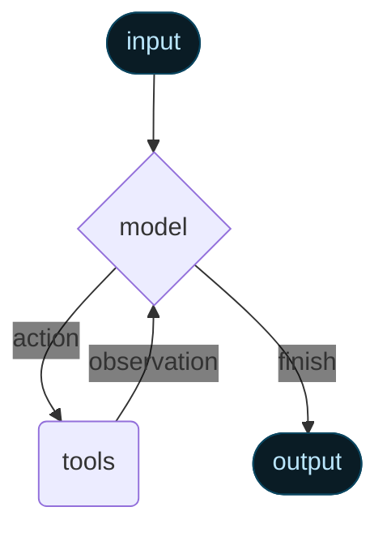

Agent는 언어 모델과 도구를 결합하여 작업에 대해 추론하고, 사용할 도구를 결정하며, 반복적으로 솔루션을 향해 작업하는 시스템을 생성합니다.

:::python
@[`create_agent`]는 프로덕션 준비가 완료된 agent 구현을 제공합니다.
:::
:::js
`createAgent()`는 프로덕션 준비가 완료된 agent 구현을 제공합니다.
:::

[LLM Agent는 목표를 달성하기 위해 루프에서 도구를 실행합니다](https://simonwillison.net/2025/Sep/18/agents/).
Agent는 중지 조건이 충족될 때까지 실행됩니다. 즉, 모델이 최종 출력을 생성하거나 반복 제한에 도달할 때까지 실행됩니다.



<Info>

:::python
@[`create_agent`]는 [LangGraph](/oss/langgraph/overview)를 사용하여 **그래프** 기반 agent 런타임을 구축합니다. 그래프는 agent가 정보를 처리하는 방법을 정의하는 노드(단계)와 엣지(연결)로 구성됩니다. Agent는 이 그래프를 통해 이동하면서 모델 노드(모델 호출), 도구 노드(도구 실행) 또는 middleware와 같은 노드를 실행합니다.
:::
:::js
`createAgent()`는 [LangGraph](/oss/langgraph/overview)를 사용하여 **그래프** 기반 agent 런타임을 구축합니다. 그래프는 agent가 정보를 처리하는 방법을 정의하는 노드(단계)와 엣지(연결)로 구성됩니다. Agent는 이 그래프를 통해 이동하면서 모델 노드(모델 호출), 도구 노드(도구 실행) 또는 middleware와 같은 노드를 실행합니다.
:::

[Graph API](/oss/langgraph/graph-api)에 대해 자세히 알아보세요.

</Info>

## 핵심 구성 요소

### Model

[Model](/oss/langchain/models)은 agent의 추론 엔진입니다. 정적 및 동적 모델 선택을 모두 지원하는 여러 방식으로 지정할 수 있습니다.

#### 정적 모델

정적 모델은 agent 생성 시 한 번 구성되며 실행 중에 변경되지 않습니다. 이것이 가장 일반적이고 간단한 접근 방식입니다. <Tooltip tip="`provider:model` 형식을 따르는 문자열 (예: openai:gpt-5)" cta="매핑 보기" href="https://reference.langchain.com/python/langchain/models/#langchain.chat_models.init_chat_model(model_provider)">모델 식별자 문자열</Tooltip>에서 정적 모델을 초기화하려면:

:::python
```python wrap
from langchain.agents import create_agent

agent = create_agent(
    "openai:gpt-5",
    tools=tools
)
```
:::
:::js
```ts wrap
import { createAgent } from "langchain";

const agent = createAgent({
  model: "openai:gpt-5",
  tools: []
});
```
:::

:::python
<Tip>
    모델 식별자 문자열은 자동 추론을 지원합니다 (예: `"gpt-5"`는 `"openai:gpt-5"`로 추론됩니다). 모델 식별자 문자열 매핑의 전체 목록은 @[참조][init_chat_model(model_provider)]를 참조하세요.
</Tip>

모델 구성을 더 세밀하게 제어하려면 provider 패키지를 사용하여 모델 인스턴스를 직접 초기화하세요:

```python wrap
from langchain.agents import create_agent
from langchain_openai import ChatOpenAI

model = ChatOpenAI(
    model="gpt-5",
    temperature=0.1,
    max_tokens=1000,
    timeout=30
    # ... (other params)
)
agent = create_agent(model, tools=tools)
```

모델 인스턴스는 구성에 대한 완전한 제어를 제공합니다. `temperature`, `max_tokens`, `timeouts`, `base_url` 및 기타 provider별 설정과 같은 특정 [매개변수](/oss/langchain/models#parameters)를 설정해야 할 때 사용하세요. 모델에서 사용 가능한 매개변수와 메서드를 보려면 [참조](/oss/integrations/providers/all_providers)를 참조하세요.
:::
:::js
모델 식별자 문자열은 `provider:model` 형식을 사용합니다 (예: `"openai:gpt-5"`). 모델 구성을 더 세밀하게 제어하려는 경우 provider 패키지를 사용하여 모델 인스턴스를 직접 초기화할 수 있습니다:

```ts wrap
import { createAgent } from "langchain";
import { ChatOpenAI } from "@langchain/openai";

const model = new ChatOpenAI({
  model: "gpt-4o",
  temperature: 0.1,
  maxTokens: 1000,
  timeout: 30
});

const agent = createAgent({
  model,
  tools: []
});
```

모델 인스턴스는 구성에 대한 완전한 제어를 제공합니다. `temperature`, `max_tokens`, `timeouts`와 같은 특정 매개변수를 설정하거나 API 키, `base_url` 및 기타 provider별 설정을 구성해야 할 때 사용하세요. 모델에서 사용 가능한 매개변수와 메서드를 보려면 [API 참조](/oss/integrations/providers/)를 참조하세요.
:::

#### 동적 모델

동적 모델은 현재 <Tooltip tip="변경 불가능한 구성과 agent 실행 전반에 걸쳐 지속되는 컨텍스트 데이터를 포함하는 agent의 실행 환경 (예: 사용자 ID, 세션 세부 정보 또는 애플리케이션별 구성).">runtime</Tooltip> 및 <Tooltip tip="메시지, 사용자 정의 필드 및 처리 중에 추적하고 잠재적으로 수정해야 하는 모든 정보를 포함하여 agent 실행을 통해 흐르는 데이터 (예: 사용자 기본 설정 또는 도구 사용 통계).">state</Tooltip>와 컨텍스트를 기반으로 선택됩니다. 이를 통해 정교한 라우팅 로직과 비용 최적화가 가능합니다.

:::python

동적 모델을 사용하려면 요청에서 모델을 수정하는 @[`@wrap_model_call`] 데코레이터로 middleware를 생성하세요:

```python wrap
from langchain_openai import ChatOpenAI
from langchain.agents import create_agent
from langchain.agents.middleware import wrap_model_call, ModelRequest, ModelResponse

basic_model = ChatOpenAI(model="gpt-4o-mini")
advanced_model = ChatOpenAI(model="gpt-4o")

@wrap_model_call
def dynamic_model_selection(request: ModelRequest, handler) -> ModelResponse:
    """대화 복잡도에 따라 모델을 선택합니다."""
    message_count = len(request.state["messages"])

    if message_count > 10:
        # 긴 대화에는 고급 모델 사용
        model = advanced_model
    else:
        model = basic_model

    request.model = model
    return handler(request)

agent = create_agent(
    model=basic_model,  # 기본 모델
    tools=tools,
    middleware=[dynamic_model_selection]
)
```

<Note>
사전 바인딩된 모델 (@[`bind_tools`][BaseChatModel.bind_tools]가 이미 호출된 모델)은 구조화된 출력을 사용할 때 지원되지 않습니다. 구조화된 출력으로 동적 모델 선택이 필요한 경우 middleware에 전달된 모델이 사전 바인딩되지 않았는지 확인하세요.
</Note>

:::
:::js

동적 모델을 사용하려면 요청에서 모델을 수정하는 `wrapModelCall`로 middleware를 생성하세요:

```ts wrap
import { ChatOpenAI } from "@langchain/openai";
import { createAgent, createMiddleware } from "langchain";

const basicModel = new ChatOpenAI({ model: "gpt-4o-mini" });
const advancedModel = new ChatOpenAI({ model: "gpt-4o" });

const dynamicModelSelection = createMiddleware({
  name: "DynamicModelSelection",
  wrapModelCall: (request, handler) => {
    // 대화 복잡도에 따라 모델 선택
    const messageCount = request.messages.length;

    return handler({
        ...request,
        model: messageCount > 10 ? advancedModel : basicModel,
    });
  },
});

const agent = createAgent({
  model: "gpt-4o-mini", // 기본 모델 (messageCount ≤ 10일 때 사용)
  tools,
  middleware: [dynamicModelSelection] as const,
});
```

middleware 및 고급 패턴에 대한 자세한 내용은 [middleware 문서](/oss/langchain/middleware)를 참조하세요.
:::

<Tip>
모델 구성 세부 정보는 [Models](/oss/langchain/models)를 참조하세요. 동적 모델 선택 패턴은 [middleware의 동적 모델](/oss/langchain/middleware#dynamic-model)을 참조하세요.
</Tip>

### 도구

도구는 agent에게 작업을 수행할 수 있는 능력을 제공합니다. Agent는 다음과 같은 기능을 촉진함으로써 단순한 모델 전용 도구 바인딩을 넘어섭니다:

- 순차적으로 여러 도구 호출 (단일 프롬프트로 트리거됨)
- 적절한 경우 병렬 도구 호출
- 이전 결과를 기반으로 한 동적 도구 선택
- 도구 재시도 로직 및 오류 처리
- 도구 호출 전반에 걸친 state 지속성

#### 도구 정의

Agent에 도구 목록을 전달합니다.

:::python
```python wrap
from langchain.tools import tool
from langchain.agents import create_agent

@tool
def search(query: str) -> str:
    """정보를 검색합니다."""
    return f"Results for: {query}"

@tool
def get_weather(location: str) -> str:
    """위치에 대한 날씨 정보를 가져옵니다."""
    return f"Weather in {location}: Sunny, 72°F"

agent = create_agent(model, tools=[search, get_weather])
```
:::
:::js
```ts wrap
import * as z from "zod";
import { createAgent, tool } from "langchain";

const search = tool(
  ({ query }) => `Results for: ${query}`,
  {
    name: "search",
    description: "Search for information",
    schema: z.object({
      query: z.string().describe("The query to search for"),
    }),
  }
);

const getWeather = tool(
  ({ location }) => `Weather in ${location}: Sunny, 72°F`,
  {
    name: "get_weather",
    description: "Get weather information for a location",
    schema: z.object({
      location: z.string().describe("The location to get weather for"),
    }),
  }
);

const agent = createAgent({
  model: "openai:gpt-4o",
  tools: [search, getWeather],
});
```
:::

빈 도구 목록이 제공되면 agent는 도구 호출 기능 없이 단일 LLM 노드로 구성됩니다.

#### 도구 오류 처리

:::python

도구 오류 처리 방법을 사용자 정의하려면 @[`@wrap_tool_call`] 데코레이터를 사용하여 middleware를 생성하세요:

```python wrap
from langchain.agents import create_agent
from langchain.agents.middleware import wrap_tool_call
from langchain_core.messages import ToolMessage

@wrap_tool_call
def handle_tool_errors(request, handler):
    """사용자 정의 메시지로 도구 실행 오류를 처리합니다."""
    try:
        return handler(request)
    except Exception as e:
        # 모델에 사용자 정의 오류 메시지 반환
        return ToolMessage(
            content=f"Tool error: Please check your input and try again. ({str(e)})",
            tool_call_id=request.tool_call["id"]
        )

agent = create_agent(
    model="openai:gpt-4o",
    tools=[search, calculate],
    middleware=[handle_tool_errors]
)
```

Agent는 도구가 실패할 때 사용자 정의 오류 메시지와 함께 @[`ToolMessage`]를 반환합니다:

```python
# result["messages"]
[
    ...
    ToolMessage(
        content="Tool error: Please check your input and try again. (division by zero)",
        tool_call_id="..."
    ),
    ...
]
```

:::
:::js

도구 오류 처리 방법을 사용자 정의하려면 사용자 정의 middleware에서 `wrapToolCall` 훅을 사용하세요:

```ts wrap
import { createAgent, createMiddleware, ToolMessage } from "langchain";

const handleToolErrors = createMiddleware({
  name: "HandleToolErrors",
  wrapToolCall: (request, handler) => {
    try {
      return handler(request);
    } catch (error) {
      // 모델에 사용자 정의 오류 메시지 반환
      return new ToolMessage({
        content: `Tool error: Please check your input and try again. (${error})`,
        tool_call_id: request.toolCall.id!,
      });
    }
  },
});

const agent = createAgent({
  model: "openai:gpt-4o",
  tools: [
    /* ... */
  ],
  middleware: [handleToolErrors] as const,
});
```

Agent는 도구가 실패할 때 사용자 정의 오류 메시지와 함께 @[`ToolMessage`]를 반환합니다.
:::

<Tip>
도구에 대한 자세한 내용은 [도구](/oss/langchain/tools)를 참조하세요.
</Tip>

#### ReAct 루프에서의 도구 사용

Agent는 ReAct("추론 + 행동") 패턴을 따르며, 짧은 추론 단계와 타겟 도구 호출을 교대로 수행하고 결과 관찰을 후속 결정에 반영하여 최종 답변을 제공할 때까지 반복합니다.

<Accordion title="ReAct 루프 예제">
프롬프트: 현재 가장 인기 있는 무선 헤드폰을 식별하고 재고 여부를 확인하세요.

```
================================ Human Message =================================

Find the most popular wireless headphones right now and check if they're in stock
```

* **추론**: "인기도는 시간에 민감하므로 제공된 검색 도구를 사용해야 합니다."
* **행동**: `search_products("wireless headphones")` 호출

```
================================== Ai Message ==================================
Tool Calls:
  search_products (call_abc123)
 Call ID: call_abc123
  Args:
    query: wireless headphones
```
```
================================= Tool Message =================================

Found 5 products matching "wireless headphones". Top 5 results: WH-1000XM5, ...
```

* **추론**: "답변하기 전에 최상위 항목의 재고를 확인해야 합니다."
* **행동**: `check_inventory("WH-1000XM5")` 호출

```
================================== Ai Message ==================================
Tool Calls:
  check_inventory (call_def456)
 Call ID: call_def456
  Args:
    product_id: WH-1000XM5
```
```
================================= Tool Message =================================

Product WH-1000XM5: 10 units in stock
```

* **추론**: "가장 인기 있는 모델과 재고 상태를 확보했습니다. 이제 사용자의 질문에 답변할 수 있습니다."
* **행동**: 최종 답변 생성

```
================================== Ai Message ==================================

I found wireless headphones (model WH-1000XM5) with 10 units in stock...
```
</Accordion>

<Tip>
도구에 대해 자세히 알아보려면 [도구](/oss/langchain/tools)를 참조하세요.
</Tip>

### 시스템 프롬프트

프롬프트를 제공하여 agent가 작업에 접근하는 방식을 형성할 수 있습니다. @[`system_prompt`] 매개변수는 문자열로 제공될 수 있습니다:

:::python
```python wrap
agent = create_agent(
    model,
    tools,
    system_prompt="You are a helpful assistant. Be concise and accurate."
)
```
:::
:::js
```ts wrap
const agent = createAgent({
  model,
  tools,
  systemPrompt: "You are a helpful assistant. Be concise and accurate.",
});
```
:::

@[`system_prompt`]가 제공되지 않으면 agent는 메시지에서 직접 작업을 추론합니다.

#### 동적 시스템 프롬프트

런타임 컨텍스트 또는 agent state를 기반으로 시스템 프롬프트를 수정해야 하는 고급 사용 사례의 경우 [middleware](/oss/langchain/middleware)를 사용할 수 있습니다.

:::python

@[`@dynamic_prompt`] 데코레이터는 모델 요청을 기반으로 시스템 프롬프트를 동적으로 생성하는 middleware를 생성합니다:

```python wrap
from typing import TypedDict

from langchain.agents import create_agent
from langchain.agents.middleware import dynamic_prompt, ModelRequest

class Context(TypedDict):
    user_role: str

@dynamic_prompt
def user_role_prompt(request: ModelRequest) -> str:
    """사용자 역할에 따라 시스템 프롬프트를 생성합니다."""
    user_role = request.runtime.context.get("user_role", "user")
    base_prompt = "You are a helpful assistant."

    if user_role == "expert":
        return f"{base_prompt} Provide detailed technical responses."
    elif user_role == "beginner":
        return f"{base_prompt} Explain concepts simply and avoid jargon."

    return base_prompt

agent = create_agent(
    model="openai:gpt-4o",
    tools=[web_search],
    middleware=[user_role_prompt],
    context_schema=Context
)

# 시스템 프롬프트는 컨텍스트에 따라 동적으로 설정됩니다
result = agent.invoke(
    {"messages": [{"role": "user", "content": "Explain machine learning"}]},
    context={"user_role": "expert"}
)
```
:::

:::js
```typescript wrap
import * as z from "zod";
import { createAgent, dynamicSystemPromptMiddleware } from "langchain";

const contextSchema = z.object({
  userRole: z.enum(["expert", "beginner"]),
});

const agent = createAgent({
  model: "openai:gpt-4o",
  tools: [/* ... */],
  contextSchema,
  middleware: [
    dynamicSystemPromptMiddleware<z.infer<typeof contextSchema>>((state, runtime) => {
      const userRole = runtime.context.userRole || "user";
      const basePrompt = "You are a helpful assistant.";

      if (userRole === "expert") {
        return `${basePrompt} Provide detailed technical responses.`;
      } else if (userRole === "beginner") {
        return `${basePrompt} Explain concepts simply and avoid jargon.`;
      }
      return basePrompt;
    }),
  ],
});

// 시스템 프롬프트는 컨텍스트에 따라 동적으로 설정됩니다
const result = await agent.invoke(
  { messages: [{ role: "user", content: "Explain machine learning" }] },
  { context: { userRole: "expert" } }
);
```
:::

<Tip>
메시지 유형 및 포맷에 대한 자세한 내용은 [Messages](/oss/langchain/messages)를 참조하세요. 포괄적인 middleware 문서는 [Middleware](/oss/langchain/middleware)를 참조하세요.
</Tip>

## 호출

Agent의 [state](/oss/langgraph/graph-api#state)에 업데이트를 전달하여 agent를 호출할 수 있습니다. 모든 agent는 state에 [메시지 시퀀스](/oss/langgraph/use-graph-api#messagesstate)를 포함합니다. Agent를 호출하려면 새 메시지를 전달하세요:

:::python
```python
result = agent.invoke(
    {"messages": [{"role": "user", "content": "What's the weather in San Francisco?"}]}
)
```
:::
:::js
```typescript
await agent.invoke({
  messages: [{ role: "user", content: "What's the weather in San Francisco?" }],
})
```
:::

Agent에서 단계 및/또는 토큰을 스트리밍하려면 [스트리밍](/oss/langchain/streaming) 가이드를 참조하세요.

그렇지 않으면 agent는 LangGraph [Graph API](/oss/langgraph/use-graph-api)를 따르며 관련된 모든 메서드를 지원합니다.

## 고급 개념

### 구조화된 출력

:::python

특정 형식으로 agent가 출력을 반환하도록 하고 싶은 경우가 있습니다. LangChain은 @[`response_format`][ModelRequest(response_format)] 매개변수를 통해 구조화된 출력을 위한 전략을 제공합니다.

#### ToolStrategy

`ToolStrategy`는 인위적인 도구 호출을 사용하여 구조화된 출력을 생성합니다. 이것은 도구 호출을 지원하는 모든 모델에서 작동합니다:

```python wrap
from pydantic import BaseModel
from langchain.agents import create_agent
from langchain.agents.structured_output import ToolStrategy

class ContactInfo(BaseModel):
    name: str
    email: str
    phone: str

agent = create_agent(
    model="openai:gpt-4o-mini",
    tools=[search_tool],
    response_format=ToolStrategy(ContactInfo)
)

result = agent.invoke({
    "messages": [{"role": "user", "content": "Extract contact info from: John Doe, john@example.com, (555) 123-4567"}]
})

result["structured_response"]
# ContactInfo(name='John Doe', email='john@example.com', phone='(555) 123-4567')
```

#### ProviderStrategy

`ProviderStrategy`는 모델 provider의 네이티브 구조화된 출력 생성을 사용합니다. 이것은 더 신뢰할 수 있지만 네이티브 구조화된 출력을 지원하는 provider에서만 작동합니다 (예: OpenAI):

```python wrap
from langchain.agents.structured_output import ProviderStrategy

agent = create_agent(
    model="openai:gpt-4o",
    response_format=ProviderStrategy(ContactInfo)
)
```

<Note>
v1에서는 스키마를 단순히 전달하는 것 (예: `response_format=ContactInfo`)이 더 이상 지원되지 않습니다. `ToolStrategy` 또는 `ProviderStrategy`를 명시적으로 사용해야 합니다.
</Note>

:::
:::js
특정 형식으로 agent가 출력을 반환하도록 하고 싶은 경우가 있습니다. LangChain은 `responseFormat` 매개변수를 사용하여 이를 수행하는 간단하고 보편적인 방법을 제공합니다.

```ts wrap
import * as z from "zod";
import { createAgent } from "langchain";

const ContactInfo = z.object({
  name: z.string(),
  email: z.string(),
  phone: z.string(),
});

const agent = createAgent({
  model: "openai:gpt-4o",
  responseFormat: ContactInfo,
});

const result = await agent.invoke({
  messages: [
    {
      role: "user",
      content: "Extract contact info from: John Doe, john@example.com, (555) 123-4567",
    },
  ],
});

console.log(result.structuredResponse);
// {
//   name: 'John Doe',
//   email: 'john@example.com',
//   phone: '(555) 123-4567'
// }
```
:::
<Tip>
구조화된 출력에 대해 자세히 알아보려면 [구조화된 출력](/oss/langchain/structured-output)을 참조하세요.
</Tip>

### Memory

Agent는 메시지 state를 통해 대화 히스토리를 자동으로 유지합니다. 대화 중에 추가 정보를 기억하도록 사용자 정의 state 스키마를 사용하도록 agent를 구성할 수도 있습니다.

State에 저장된 정보는 agent의 [단기 메모리](/oss/langchain/short-term-memory)로 생각할 수 있습니다:

:::python

사용자 정의 state 스키마는 `TypedDict`로 @[`AgentState`]를 확장해야 합니다.

사용자 정의 state를 정의하는 두 가지 방법이 있습니다:
1. [Middleware](/oss/langchain/middleware)를 통해 (선호됨)
2. @[`create_agent`]의 @[`state_schema`]를 통해

<Note>
Middleware를 통해 사용자 정의 state를 정의하는 것이 @[`create_agent`]의 @[`state_schema`]를 통해 정의하는 것보다 선호됩니다. 이는 관련 middleware 및 도구에 개념적으로 범위가 지정된 state 확장을 유지할 수 있기 때문입니다.

@[`state_schema`]는 @[`create_agent`]에서 하위 호환성을 위해 여전히 지원됩니다.
</Note>

#### Middleware를 통한 state 정의

특정 middleware 훅과 해당 middleware에 연결된 도구에서 사용자 정의 state에 액세스해야 할 때 middleware를 사용하여 사용자 정의 state를 정의하세요.

```python
class CustomState(AgentState):
    user_preferences: dict

class CustomMiddleware(AgentMiddleware):
    state_schema = CustomState
    tools = [tool1, tool2]

    def before_model(self, state: CustomState, runtime) -> dict[str, Any] | None:
        ...

agent = create_agent(
    model,
    tools=tools,
    middleware=[CustomMiddleware()]
)

# Agent는 이제 메시지 이상의 추가 state를 추적할 수 있습니다
result = agent.invoke({
    "messages": [{"role": "user", "content": "I prefer technical explanations"}],
    "user_preferences": {"style": "technical", "verbosity": "detailed"},
})
```

#### `state_schema`를 통한 state 정의

도구에서만 사용되는 사용자 정의 state를 정의하는 바로 가기로 @[`state_schema`] 매개변수를 사용하세요.

```python
class CustomState(AgentState):
    user_preferences: dict

agent = create_agent(
    model,
    tools=[tool1, tool2],
    state_schema=CustomState
)
# Agent는 이제 메시지 이상의 추가 state를 추적할 수 있습니다
result = agent.invoke({
    "messages": [{"role": "user", "content": "I prefer technical explanations"}],
    "user_preferences": {"style": "technical", "verbosity": "detailed"},
})
```

<Note>
v1에서는 사용자 정의 state 스키마가 **반드시** `TypedDict` 유형이어야 합니다. Pydantic 모델과 dataclass는 더 이상 지원되지 않습니다. 자세한 내용은 [v1 마이그레이션 가이드](/oss/migrate/langchain-v1#state-type-restrictions)를 참조하세요.
</Note>

:::
:::js
```ts wrap
import * as z from "zod";
import { MessagesZodState } from "@langchain/langgraph";
import { createAgent, type BaseMessage } from "langchain";

const customAgentState = z.object({
  messages: MessagesZodState.shape.messages,
  userPreferences: z.record(z.string(), z.string()),
});

const CustomAgentState = createAgent({
  model: "openai:gpt-4o",
  tools: [],
  stateSchema: customAgentState,
});
```
:::

<Tip>
메모리에 대해 자세히 알아보려면 [Memory](/oss/concepts/memory)를 참조하세요. 세션 간에 지속되는 장기 메모리 구현에 대한 정보는 [장기 메모리](/oss/langchain/long-term-memory)를 참조하세요.
</Tip>

### 스트리밍

`invoke`를 사용하여 agent를 호출하여 최종 응답을 얻는 방법을 살펴보았습니다. Agent가 여러 단계를 실행하는 경우 시간이 걸릴 수 있습니다. 중간 진행 상황을 표시하려면 발생하는 메시지를 스트리밍할 수 있습니다.

:::python
```python wrap
for chunk in agent.stream({
    "messages": [{"role": "user", "content": "Search for AI news and summarize the findings"}]
}, stream_mode="values"):
    # 각 청크는 해당 시점의 전체 state를 포함합니다
    latest_message = chunk["messages"][-1]
    if latest_message.content:
        print(f"Agent: {latest_message.content}")
    elif latest_message.tool_calls:
        print(f"Calling tools: {[tc['name'] for tc in latest_message.tool_calls]}")
```
:::
:::js
```ts wrap
const stream = await agent.stream(
  {
    messages: [{
      role: "user",
      content: "Search for AI news and summarize the findings"
    }],
  },
  { streamMode: "values" }
);

for await (const chunk of stream) {
  // 각 청크는 해당 시점의 전체 state를 포함합니다
  const latestMessage = chunk.messages.at(-1);
  if (latestMessage?.content) {
    console.log(`Agent: ${latestMessage.content}`);
  } else if (latestMessage?.tool_calls) {
    const toolCallNames = latestMessage.tool_calls.map((tc) => tc.name);
    console.log(`Calling tools: ${toolCallNames.join(", ")}`);
  }
}
```
:::

<Tip>
스트리밍에 대한 자세한 내용은 [스트리밍](/oss/langchain/streaming)을 참조하세요.
</Tip>

### Middleware

[Middleware](/oss/langchain/middleware)는 실행의 다양한 단계에서 agent 동작을 사용자 정의하기 위한 강력한 확장성을 제공합니다. Middleware를 사용하여 다음을 수행할 수 있습니다:

- 모델이 호출되기 전에 state 처리 (예: 메시지 트리밍, 컨텍스트 주입)
- 모델의 응답 수정 또는 검증 (예: 가드레일, 콘텐츠 필터링)
- 사용자 정의 로직으로 도구 실행 오류 처리
- State 또는 컨텍스트를 기반으로 동적 모델 선택 구현
- 사용자 정의 로깅, 모니터링 또는 분석 추가

Middleware는 핵심 agent 로직을 변경하지 않고 주요 지점에서 데이터 흐름을 가로채고 수정할 수 있도록 agent의 실행 그래프에 원활하게 통합됩니다.

:::python
<Tip>
@[`@before_model`], @[`@after_model`], @[`@wrap_tool_call`]과 같은 데코레이터를 포함한 포괄적인 middleware 문서는 [Middleware](/oss/langchain/middleware)를 참조하세요.
</Tip>
:::

:::js
<Tip>
`beforeModel`, `afterModel`, `wrapToolCall`과 같은 훅을 포함한 포괄적인 middleware 문서는 [Middleware](/oss/langchain/middleware)를 참조하세요.
</Tip>
:::
